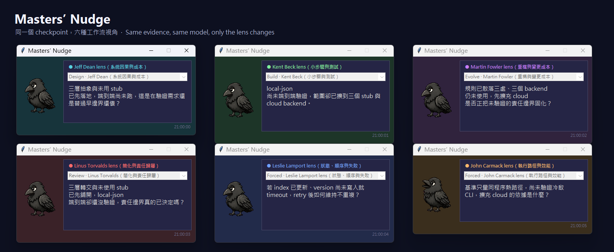

# Masters’ Nudge

[繁體中文](README.zh-TW.md) | English

**Add a different voice to long-running Claude Code or Codex CLI tasks.**



*Same evidence and model; only the lens changes. These are unedited reviewer
outputs rendered by six real Tk windows. Representatives were selected for
completeness and lens alignment; the controlled run found stable differentiation
for five of six lenses. [See the evaluation and selection details.](evaluation/results/lens-differentiation-v2-20260813/LENS_DIFFERENTIATION_RESULT.md)*

## Overview

The longer a coding agent works, the more its early choices shape everything that follows.

When the direction is right, this builds momentum. When it is wrong, the agent may keep patching and working around the same idea until the task looks finished but still carries a problem nobody stopped to question.

At a few key moments, Masters’ Nudge asks another model to look at a small piece of how the work is unfolding and leave one useful reason to reconsider the next move. If the evidence offers no grounded new angle, it stays quiet.

Your coding agent still does the work and makes the decisions. Masters’ Nudge simply adds a different voice beside it. Supported hosts are Claude Code and Codex CLI 0.147+.

## Why only one line?

Each nudge is at most 52 characters and points to one concrete workflow tension or question.

It may surface an assumption that was never revisited, feedback that stops too early, growing scope, a fragile event order, or a completion claim that has moved ahead of its evidence.

The point is not to produce another answer or another code review. It is to give the same workflow one brief look from another angle before the agent continues.

## Why another model?

When the same model continues its own work, it can carry the same assumptions into the next decision.

The reviewer defaults to OpenAI `gpt-5.6-sol`; Anthropic `claude -p` is optional. With an Anthropic main agent this also changes vendor family. With Codex as the main agent, choose the reviewer provider deliberately—the separation is a second context and role, not necessarily a different model family.

The second model receives only a small packet of current evidence and must ground its nudge in that material. Code, tests, and tool output may anchor the observation, but the target is how the work is being framed, sequenced, scoped, tested, or declared complete. If the evidence does not support a useful nudge, it says nothing.

## When does it join in?

```
Coding agent works normally
    │ tool failure / test failure / first large change
    ├─► check once → main agent only
    │
    │ turn ends
    └─► check once in the background
              ├─ give it to the agent on your next message
              └─ show it in the floating window
```

| Moment | Why look again? | Who sees it? |
|---|---|---|
| Tool failure | The fix may address only the surface symptom | Main agent |
| Test failure | The repair may be taking a longer route around the problem | Main agent |
| First change over ~80 lines | The task may be growing beyond its original scope | Main agent |
| End of turn | Check whether the work is actually complete | Main agent and the floating window |

Mid-turn checks call the model only for the first three cases and may pause the main agent for up to about 15 seconds. End-of-turn checks run in the background and do not block the completed turn. Claude Code reports failures through `PostToolUseFailure`; the Codex adapter can infer structured non-zero exits and failure status when Codex delivers them in `PostToolUse`. The tested Windows 0.147.0 build did not emit that event for a non-zero Bash result, so immediate failure checks are best-effort there and Stop remains the fallback.

The main agent receives an end-of-turn nudge when you send your next message. The floating window reads both hosts' namespaced logs and is the direct user-visible channel.

Output is either one finding or silence. Findings are stripped of markdown and filler, with a hard limit of 52 characters.

## Who this is for

**Suitable** if you use Claude Code or Codex CLI and accept that review content (your prompt, tool output, file snippets, errors, etc.) leaves the machine for an external model API (**OpenAI by default**; Anthropic optional).

**Not suitable** where conversation or code must not leave the machine. Details: [Privacy](#privacy). Do not install if that is a hard constraint.

Cost: by default **every completed turn** calls the review model once; mid-turn calls only on error / test failure / first large change. Busy days accumulate tokens.

## Install

### Prerequisites

- Claude Code, Codex CLI 0.147+, or both
- A working reviewer CLI: [Codex CLI](https://github.com/openai/codex) by default, or `MASTERS_NUDGE_PROVIDER=anthropic` with `claude -p`
- Python 3.10+
- Git

### Steps

1. Clone the repository and enter its directory:

```bash
git clone https://github.com/shihchengwei-lab/masters-nudge.git
cd masters-nudge
```

2. Install the shared runtime and adapters. Neither installer edits host settings:

```bash
bash install.sh --all
```

On Windows PowerShell:

```powershell
.\install.ps1 -HostName all
```

Use `--claude` / `--codex` (or `-HostName claude` / `codex`) for one host. Shared runtime: `~/.masters-nudge/runtime/`; the legacy Claude compatibility target remains `~/.claude/scripts/buddy/` for existing installations.

3. Enable hooks for each host you use:

   - **Claude Code:** merge the `hooks` from [`settings-snippet.json`](settings-snippet.json) into `~/.claude/settings.json`.
   - **Codex CLI 0.147+:** merge the `hooks` from [`codex-hooks-snippet.json`](codex-hooks-snippet.json) into `~/.codex/hooks.json`, preserve existing hooks, then inspect and trust them through `/hooks`. For automation, Codex also exposes `--dangerously-bypass-hook-trust`; use it only after reviewing the commands. See the [official hooks documentation](https://learn.chatgpt.com/docs/hooks).

Do not replace either whole settings file.

4. (Optional) Floating window — otherwise you almost never see end-of-turn lines in the UI:

```bash
pip install Pillow
```

- **Windows:** double-click `~/.claude/scripts/buddy/start_buddy_window.bat`
- **macOS / Linux:** `python3 ~/.claude/scripts/buddy/buddy_window.py &`

Closing the window does not disable hooks.

### Verify

- Force a failing test, or finish a turn: a checkpoint hit may add a few seconds of wait; the next prompt should receive any end-of-turn finding.
- New logs: `~/.masters-nudge/data/<host>--<session_id>.log`; errors: `~/.masters-nudge/data/error.log`.
- No log at all: hooks are usually not merged/trusted, or the reviewer CLI / provider call is failing.

## Filters: different stages, different workflow questions

Different parts of a project make different problems easy to miss.

During design, data, state, and ownership matter most. During implementation, scope can quietly grow. As the code evolves, today's structure can make tomorrow's change harder. Before delivery, it is worth asking which layers never needed to exist.

| Stage | Viewpoint | First question |
|---|---|---|
| Design | Jeff Dean (`jeff`) | Are data, state, or ownership in the wrong place? |
| Build | Kent Beck (`beck`) | Has the work grown beyond what is needed now? |
| Evolve | Martin Fowler (`fowler`) | Will this structure make the next change harder? |
| Review | Linus Torvalds (`linus`) | Which extra layers do not need to exist? |

Two more viewpoints join for one review when there is a clear signal:

- Retry, idempotency, races, duplicate handling, event order, or partial failure bring in Leslie Lamport (`lamport`).
- A profiler, benchmark, or measured latency, throughput, allocation, copying, I/O, or hot-path cost brings in John Carmack (`carmack`).

If both match, Lamport goes first because correctness comes before speed. A lone word such as `async`, `cache`, `performance`, or `latency` is not enough to switch viewpoints.

Each name stands for a conceptual lens and a set of attention areas. The nudge does not imitate that person's voice and does not add another code review; it uses visible technical facts only as anchors for reconsidering the workflow.

Whatever the stage, explicit destructive action, security or authorization risk, drift from the user's request, and completion claims contradicted by visible evidence still stop the line first.

The floating-window dropdown stores the stage in `~/.masters-nudge/data/config.json`. Your choice applies from the next review; Build is the default. The dropdown shows your chosen stage; the colored badge shows the viewpoint used for the latest nudge. A temporary Lamport or Carmack review changes the badge, not the dropdown. A pre-existing `~/.claude/buddy/config.json` remains readable until a new neutral config is saved.

New configuration files use `{"stage":"build"}`. Valid stages are `design`, `build`, `evolve`, and `review`. General workflow evidence and stop-the-line checks are the shared base for every stage, not a selectable filter.

`MASTERS_NUDGE_PERSONA` (or legacy `BUDDY_PERSONA`) set before the host starts remains a force override and disables specialist switching. Old persona-based config files remain readable: the four lifecycle lenses map to their stages, old General settings fall back to the default Build stage, and old Lamport/Carmack choices stay locked until a stage is selected in the window.

A lens changes which part of the workflow gets reconsidered first. It does not change the evidence rules, model-call count, single-Nudge limit, or length cap. Files under `personas/` append to `buddy-prompt.txt`. All six viewpoints share one model call; they are not six agents speaking at once.

<details>
<summary>Filter notes</summary>

##### Jeff Dean — systems causality and cost

> “As systems scale up, simply stamping out all sources of variability does not work.” — [Jeff Dean](https://research.google/pubs/achieving-rapid-response-times-in-large-online-services/)

Which real constraint caused each mechanism; cost through data flow, latency, state, failure handling, operations — without assuming Google scale.

##### Linus Torvalds — directness and ownership

> “Talk is cheap. Show me the code.” — [Linus Torvalds](https://groups.google.com/g/mlist.linux.kernel/c/pdl_7y9bPgk)

Decisions deferred through wrappers and indirection; whether the workflow still has one clear path and owner. Conceptual focus, not tone.

##### Martin Fowler — knowledge boundaries and safer change

> “…to make it easier to understand and cheaper to modify without changing its observable behavior.” — [Martin Fowler](https://martinfowler.com/bliki/DefinitionOfRefactoring.html)

What the current change reveals about where knowledge belongs and how expensive the next change will be; small, behavior-preserving steps over open-ended rewrites.

##### Kent Beck — feedback loops and small steps

> “You don’t always have to take tiny steps, but they are always an option.” — [Kent Beck](https://newsletter.kentbeck.com/p/first-one-then-many)

The shortest path from the current assumption to useful feedback; whether the work keeps growing after its stopping condition has been met.

##### Leslie Lamport — state, order, failure

> “A distributed system is one in which the failure of a computer you didn’t even know existed can render your own computer unusable.” — [Leslie Lamport](https://www.microsoft.com/en-us/research/publication/distribution/)

Assumptions about state and event order; whether retries, duplication, delay, or partial failure break the promised invariant.

##### John Carmack — path that actually runs

> “Sometimes, the elegant implementation is just a function. Not a method. Not a class. Not a framework. Just a function.” — [John Carmack](https://twitter.com/ID_AA_Carmack/status/53512300451201024)

What actually runs and what was actually measured; whether the chosen path removes work or merely rearranges it.

</details>

Default OpenAI is intentional and gives an Anthropic main agent a different vendor family. With a Codex main agent it remains a separate reviewer invocation, not a cross-vendor check. This is a design choice, not an accuracy claim.

## Configure

`MASTERS_NUDGE_*` is the preferred namespace. Every listed `BUDDY_*` name remains a compatibility alias for existing installations.

| Env var | Default | Effect |
|---|---|---|
| `MASTERS_NUDGE_PROVIDER` / `BUDDY_PROVIDER` | `openai` | `openai` (`codex exec`) or `anthropic` (`claude -p`) |
| `MASTERS_NUDGE_MODEL` / `BUDDY_MODEL` | `gpt-5.6-sol` / `sonnet` | Model name for the chosen CLI |
| `MASTERS_NUDGE_TIMEOUT` / `BUDDY_TIMEOUT` | `60` | End-of-turn model-call timeout (seconds) |
| `MASTERS_NUDGE_CHECKPOINT_TIMEOUT` / `BUDDY_CHECKPOINT_TIMEOUT` | `15` | Max wait for a mid-turn review (seconds) |
| `MASTERS_NUDGE_DATA_DIR` | `~/.masters-nudge/data` | New logs, state, config, and content-free telemetry |
| `MASTERS_NUDGE_RUNTIME_DIR` | `~/.masters-nudge/runtime` | Shared installed runtime |
| `MASTERS_NUDGE_PERSONA` / `BUDDY_PERSONA` | unset | Force `jeff`, `beck`, `fowler`, `linus`, `lamport`, or `carmack`; wins over the window and specialist routing |
| `MASTERS_NUDGE_SPRITE_PATH` / `BUDDY_SPRITE_PATH` | shipped spritesheet | Custom transparent spritesheet |
| `MASTERS_NUDGE_SHADOW_EVALUATION_DAYS` / `BUDDY_SHADOW_EVALUATION_DAYS` | `7` | Shadow cost-policy evaluation length |
| `MASTERS_NUDGE_SHADOW_TARGET_CALLS` / `BUDDY_SHADOW_TARGET_CALLS` | `300` | Sample-size target for that evaluation |
| `BUDDY_CLAUDE_DIR` | unset | Legacy compatibility override; when explicitly set, preserves old Claude data paths |

Review copy: `~/.masters-nudge/runtime/buddy-prompt.txt` (the Claude compatibility copy remains under `~/.claude/scripts/buddy/`).

### Cost telemetry and shadow evaluation

First review after install opens a fixed 7-day shadow window: candidate skips are labeled only; every review still runs. First review on or after day seven writes `~/.masters-nudge/data/shadow-evaluation.md` and shows one notice. Below 300 calls → `insufficient_samples`. No silent extension; no automatic skip enablement.

Each review appends content-free metadata to `~/.masters-nudge/data/review-telemetry.jsonl`, including host, turn, stage, primary lens, effective lens, specialist trigger, and route source. Reaction log entries keep `persona` as the effective lens and carry the same route metadata. Delete `shadow-evaluation.json`, `shadow-evaluation.md`, and `review-telemetry.jsonl` to start a fresh evaluation window.

## Privacy

**Conversation and tool-event data go to an external model provider.** Each end-of-turn review and each matching mid-turn review is a separate egress. A payload may include:

1. Latest user prompt (≤2000 chars; long text keeps head and tail with an explicit middle cut)
2. Mid-turn: triggering tool event (≤3000) and recent agent context (≤1200)
3. End of turn: last claim (≤2500) and current-turn tool results (≤2000; may include Read contents, command output, errors, diffs). Claude can fall back to a bounded transcript slice; Codex never parses its transcript and instead uses the bounded PostToolUse journal
4. Optional agentcam excerpts (combined ≤2000)
5. Up to 3 prior short reactions in the session (reduces repetition)
6. Review system prompt and optional persona file (instructions, not your project source as such)

Default `MASTERS_NUDGE_PROVIDER=openai` forwards the evidence packet to OpenAI regardless of host. Switching provider mid-session can resend earlier reactions to the new vendor as recent context. Reactions, task anchors, and bounded tool journals are stored in plain text under `~/.masters-nudge/data/`. Existing `~/.claude/buddy/` logs and config remain readable but are not automatically moved or deleted.

If even same-vendor egress is unacceptable, do not enable. Provider retention/training terms change; check current API policy.

## Optional integrations

### agentcam

With [agentcam](https://github.com/shihchengwei-lab/agentcam), selected report sections (risk, changed files, exit codes, tests, verification) attach when present. Without it, review still runs on task anchor, claim, and tool evidence.

### Custom sprite

```bash
export BUDDY_SPRITE_PATH=/path/to/spritesheet.png
```

Missing file: window opens without animation.

The shipped Rook sheet uses two six-frame rows: quiet idle, then a short review
reaction. The quiet outer-window background follows the effective lens shown
by the badge; specialist takeovers change it for that review without changing
the saved lifecycle stage. Rook itself remains graphite black.

### Localization

Shipped prompt language is Traditional Chinese. For another language, update `buddy-prompt.txt`, the hard-coded wrapper in `inject.py` (search for `第三方第二意見`), and optionally Chinese fixtures in `test_buddy.py`. Plumbing is language-neutral.

## Implementation notes

Codex normalizes hook payloads into prompt-submitted, tool-completed, and
turn-stopped events. The Claude compatibility hooks translate checkpoint tool
events and otherwise update turn state or construct the same `ReviewRequest`
contract directly. Both review paths enter `ReviewCore` without host-specific
pass-through callbacks.

The shared core owns lens routing, prompt composition, provider dispatch, the
42-character completion target / 52-character hard cap, structured-output
handling, recent-reaction context, reaction persistence, and telemetry. Host
adapters own native event parsing, evidence capture, turn journals, checkpoint
deduplication, and delivery state. Shared evidence helpers build a small labeled
packet rather than resending a full transcript. Output contract:
`reaction-schema.json`.

New runtime and data paths are host-neutral. Script paths still use `buddy.py`, `BUDDY_*`, and `~/.claude/buddy/` as a compatibility layer for existing installations; old data is read in place and never migrated or removed automatically. Product name is Masters’ Nudge.

| Component | Path |
|---|---|
| Install | `install.sh` or `install.ps1` → `~/.masters-nudge/runtime/` |
| Hook snippets | Claude `settings-snippet.json`; Codex `codex-hooks-snippet.json` |
| Shared core | `masters_nudge/core.py`, `contracts.py`, `providers.py` |
| Architecture | `docs/phase-c-architecture.md` |
| Codex adapter | `hook_entry.py`, `masters_nudge/codex_adapter.py` |
| Claude compatibility adapter | `checkpoint.py`, `buddy.py`, `inject.py` and shell wrappers |
| Evidence packets | `source_context.py` |
| Prompts / routing | `buddy-prompt.txt`, `personas/*.txt`, `lens_router.py` |
| Output contract | `reaction-schema.json` |
| Floating UI | `buddy_window.py`, `start_buddy_window.bat` |
| Tests | `python -m unittest discover -v` |
| Roadmap | `ROADMAP.md` |
| Historical notes | `BUDDY_FORENSICS_REPORT.md` |

Runtime:

| Path | Purpose |
|---|---|
| `~/.masters-nudge/data/<host>--<session_id>.log` | Reaction JSONL |
| `~/.masters-nudge/data/<host>--<session_id>.turn.json` | Task anchor and bounded tool journal |
| `~/.masters-nudge/data/<host>--<session_id>.delivery.json` | Inject read pointer |
| `~/.masters-nudge/data/config.json` | Lifecycle stage saved by the window |
| `~/.masters-nudge/data/<host>--<session_id>.checkpoints/` | Mid-turn dedup |
| `~/.masters-nudge/data/error.log` | Error log |
| `~/.claude/buddy/*` | Read-only legacy compatibility (unless `BUDDY_CLAUDE_DIR` explicitly selects legacy mode) |

## Known limitations

- Matching mid-turn review may pause the agent up to `MASTERS_NUDGE_CHECKPOINT_TIMEOUT` / `BUDDY_CHECKPOINT_TIMEOUT` (default 15s).
- Test-failure heuristics can miss unusual runners; large-diff uses Git plus untracked text files, binaries excluded, once per session after ~80 lines.
- A terse follow-up such as “continue” replaces an earlier detailed prompt as the task anchor.
- Claude current-turn evidence can still depend on transcript write timing. Codex avoids that dependency by journaling each PostToolUse payload, bounded to 8,000 characters per turn.
- On the tested Windows Codex CLI 0.147.0 build, non-zero Bash results did not emit `PostToolUse`, despite current docs; those failures are absent from the journal and receive only Stop review. See the [live smoke result](evaluation/results/phase-c-codex-smoke-20260813/SMOKE_RESULT.md).
- That 0.147.0 build also skipped native `async: true` hooks, so the Codex Stop command uses a fast detached-worker shim. This can be retired after the minimum supported CLI demonstrably runs native async hooks.
- If the next prompt is submitted before end-of-turn review finishes, that reaction injects one turn later.
- No time cooldown; every end of turn calls a model. Cost-skip policy is shadow-only.
- Other hooks without a `MASTERS_NUDGE_ACTIVE` / `BUDDY_ACTIVE`-style guard can still loop with `claude` / `codex`.

## Origin

Hook and CLI patterns from [`cold-eyes-reviewer`](https://github.com/shihchengwei-lab/cold-eyes-reviewer); rewritten from prior Buddy/Cinder companion usage. Historical screenshots: `buddy_screenshot.png`, `cinder_screenshot.png`. Current companion: Rook, a raven shown against the effective review lens color.

## License

MIT
