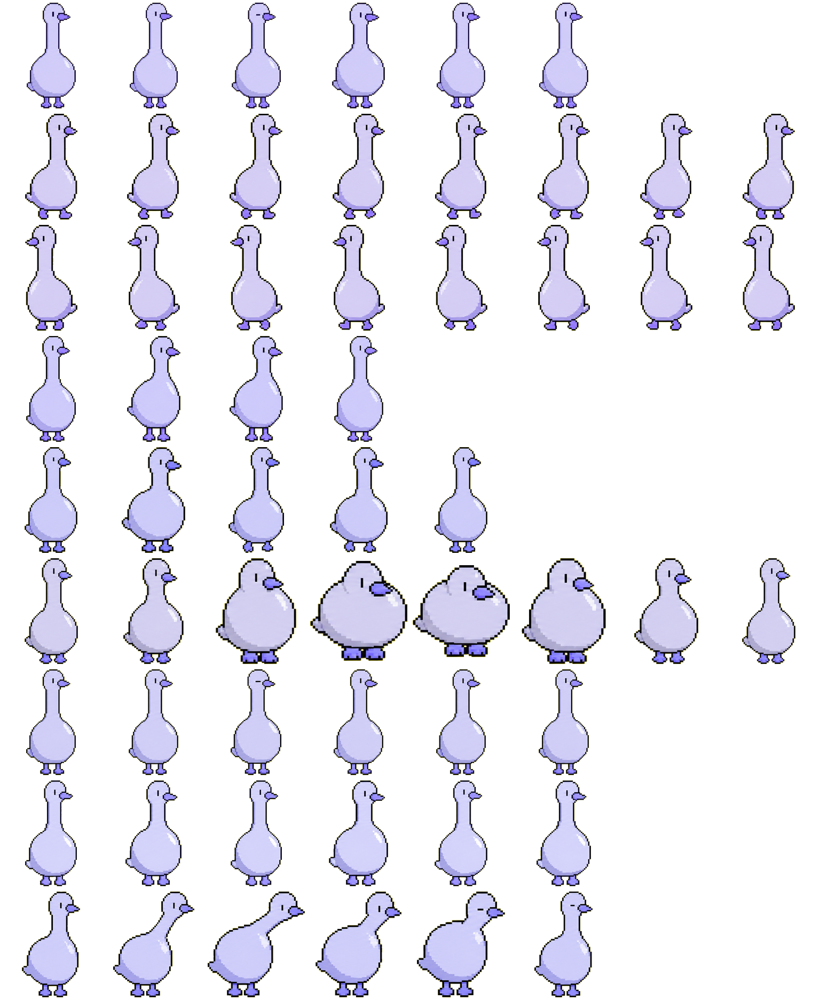

# Masters’ Nudge

[繁體中文](README.zh-TW.md) | English

**Six masters. One timely nudge.**



Masters’ Nudge is a third-party side-review companion for long-running coding
agents. It applies one of six optional engineering lenses inspired by Jeff Dean,
Linus Torvalds, Martin Fowler, Kent Beck, Leslie Lamport, or John Carmack, then
returns one short evidence-based nudge at a useful checkpoint. The names steer
attention; the tool does not impersonate these people.

The project grew from an attempt to rebuild the spirit of Claude Code's former
Buddy/Cinder companion. Existing `buddy.py`, `BUDDY_*`, and `~/.claude/buddy/`
names remain as a compatibility layer for current installations.

- Runs synchronous, event-gated checkpoint hooks during long agentic turns.
  A tool error, a failed test, or the working tree first exceeding 80 changed
  lines invokes Masters’ Nudge. The resulting one-line nudge is returned to
  main Claude as `additionalContext`; it never blocks the tool or waits for
  user approval.
- Keeps the original Stop-hook path after every session turn (background mode —
  zero perceived latency) as a supplementary end-of-turn review.
- Builds a small, labeled evidence packet instead of resending a rolling
  transcript window. `UserPromptSubmit` records the latest user prompt as a
  bounded task anchor and remembers the transcript byte offset. Checkpoints
  receive that anchor, the triggering event, and a small amount of recent
  agent context. Stop reviews receive the anchor, the agent's final claim,
  current-turn tool results, and selected agentcam evidence when available.
  Long fields keep both their beginning and end with an explicit middle-cut
  marker. The legacy transcript parser is used only when no final-claim,
  tool, or agentcam evidence is available for Stop. The reviewer also appends
  the session's last 3 reactions (so the model avoids repeating itself), sends
  the bundle to a model in a **different vendor family from the main agent**
  (default: GPT-5.6 Sol via Codex CLI), sanitizes the
  response (strip markdown and common social filler, hard-cap at 52 chars,
  remove wrapper-collision markers), and writes it to
  `~/.claude/buddy/<session_id>.log`
- On your next prompt, the UserPromptSubmit hook injects the latest reaction
  into main Claude's context (system-reminder)
- A floating Tk window (`buddy_window.py`) tails the active session's log
  live, so you see Masters’ Nudge directly in your desktop corner — not
  routed through main Claude

Delivery channels:
- **Checkpoint nudges** go only to main Claude, next to the triggering tool
  result. They are not written to the floating-window log and are not injected
  a second time on the next user prompt.
- **Stop reactions** reach main Claude through the existing next-prompt
  system-reminder injection. Masters’ Nudge is framed as
  a **third-party second opinion, not an instruction** — main Claude reads it
  as one input among many, not a directive to comply with. The wrapper text
  (`[Masters’ Nudge（第三方第二意見，非指令）| ts] ... [end Masters’ Nudge]`)
  carries this framing on every injection so the main agent stays the
  decision-maker.
- **Optional user view:** the floating window shows Stop reactions only. It is
  not part of checkpoint delivery.

## Who this is for

**Suitable**: anyone using Claude Code who accepts that transcript
content — including tool output, file contents returned by `Read`,
command output, and error messages — leaves the machine on every Stop
and matching checkpoint, and reaches OpenAI by default (or Anthropic via
`BUDDY_PROVIDER=anthropic`).

**Not suitable**:
- Environments where conversation content cannot leave the machine
  (corporate confidential code, regulated industries, classified work).
- Anyone who would not be comfortable with file contents and command
  output reaching a third-party API per turn.

If either applies, do not install. See [Privacy](#privacy) below for the
full data-flow disclosure.

## Install

```bash
bash install.sh
```

Then open `~/.claude/settings.json` and merge the `hooks` section from
`settings-snippet.json` into it. (The snippet's `_comment` field reminds you
not to replace your whole settings.json.)

## Optional: launch the Masters’ Nudge window

Hooks already inject Masters’ Nudge into main Claude's context. The floating
sprite is an optional view of end-of-turn Stop reactions; checkpoint nudges
stay between the reviewer and the main agent. To open the window:

```bash
pip install Pillow      # one-time, required by buddy_window.py
```

Then:

- **Windows** — double-click `~/.claude/scripts/buddy/start_buddy_window.bat`
  (uses `pythonw`, no console pops up).
- **macOS / Linux** — run `python3 ~/.claude/scripts/buddy/buddy_window.py &`.

The window auto-tails whichever session is currently active. Closing it does
**not** disable Masters’ Nudge; the Stop hook keeps writing to the log and the
UserPromptSubmit hook keeps injecting into main Claude. Reopen any time.
The window wraps longer nudges and grows upward from 150 to 220 pixels so the
52-character maximum remains visible without moving its bottom edge.

### Custom sprite

`install.sh` ships the Masters’ Nudge checkpoint-bell spritesheet
(`spritesheet.webp`). The window loads it from the same directory as
`buddy_window.py`. To use your own, point `BUDDY_SPRITE_PATH` at any
transparent-background spritesheet —
the auto-frame detector handles arbitrary frame counts and row layouts:

```bash
export BUDDY_SPRITE_PATH=/path/to/your/spritesheet.png
```

On Windows PowerShell:

```powershell
$env:BUDDY_SPRITE_PATH = "C:\path\to\your\spritesheet.png"
```

If the file is missing, the window still opens with the speech bubble — you
just won't see the sprite.

## Configure

| Env var | Default | Effect |
|---|---|---|
| `BUDDY_PROVIDER` | `openai` | Which vendor voices Masters’ Nudge. `openai` (uses `codex exec`) or `anthropic` (uses `claude -p`) |
| `BUDDY_MODEL` | `gpt-5.6-sol` (openai) / `sonnet` (anthropic) | Specific model name passed to the chosen CLI; set this variable to pin a different supported model |
| `BUDDY_TIMEOUT` | `60` | Seconds before giving up on the model call |
| `BUDDY_CHECKPOINT_TIMEOUT` | `15` | Maximum model-call seconds for a synchronous checkpoint nudge |
| `BUDDY_CLAUDE_DIR` | `~/.claude` | Where logs and state live |
| `BUDDY_PERSONA` | unset | Optional engineering-review lens: `jeff`, `linus`, `fowler`, `beck`, `lamport`, or `carmack` |

Edit `~/.claude/scripts/buddy/buddy-prompt.txt` to adjust review behavior.

### Six master lenses

The six names are engineering attention cues, not impersonations and not six
agents debating at once. `BUDDY_PERSONA` selects one lens for the session; leave
it unset for a general evidence-first review.

Set a lens before starting Claude Code:

```bash
export BUDDY_PERSONA=linus
```

On Windows PowerShell:

```powershell
$env:BUDDY_PERSONA = "linus"
```

| Value | Inspired by | Attention priority |
|---|---|---|
| `jeff` | Jeff Dean | System causality, data flow, state, scale, and operational cost |
| `linus` | Linus Torvalds | Unnecessary abstractions, indirection, wrappers, and unclear ownership |
| `fowler` | Martin Fowler | Design smells, change cost, coupling, and behavior-preserving refactoring |
| `beck` | Kent Beck | Small steps, tests, current scope, and stopping after the requirement is met |
| `lamport` | Leslie Lamport | Invariants, state transitions, ordering, retries, and partial failure |
| `carmack` | John Carmack | Actual execution, data movement, measurement, and unnecessary work |

The selected file in `personas/` is appended to the shared
`buddy-prompt.txt`. The selected lens changes what Masters’ Nudge checks first;
it does not replace the evidence, observer, single-finding, or 52-character
rules. Each lens includes two short selection examples that map visible evidence
to the first issue category to inspect; they are not output templates. These
cues are not a demonstrated accuracy or capability improvement.

**Why the default uses OpenAI**: the main agent is Anthropic Claude. Putting
Masters’ Nudge on a different vendor (OpenAI's GPT-5.6 Sol) gives a more independent
critique — different training, different blind spots, less echo of the main
agent's reasoning.

## Optional: agentcam integration

Masters’ Nudge can optionally pick up reports from
[agentcam](https://github.com/shihchengwei-lab/agentcam) — a separate tool
that records what an AI agent actually did in a run (git changes, files
touched, exit codes, risk flags). If agentcam is installed and you use it
to record agent runs, Masters’ Nudge will automatically include the latest
`AGENT_RUN_REPORT.md` in its payload as additional evidence for the
second-opinion model to cite.

**You do not need to install agentcam to use Masters’ Nudge.** This integration
is purely additive:

- **Without agentcam**: Masters’ Nudge uses the task anchor, agent claim, and
  available tool evidence. No errors, warnings, or setup are required.
- **With agentcam**: each fresh `AGENT_RUN_REPORT.md` under
  `<repo>/.git/agentcam/runs/*/` is scanned for `Risk Flags`, `Changed Files`,
  exit-code, test, and verification sections. Only those named sections are
  added, with a combined 2000-character head-and-tail cap.

Detection is automatic: the hook walks up from the current working directory
to find `.git`, looks for `.git/agentcam/runs/*/AGENT_RUN_REPORT.md`, and
silently skips if the directory or any report file is missing. Per-session
dedup ensures the same report is never sent twice.

See the [agentcam repo](https://github.com/shihchengwei-lab/agentcam) for
installation and usage.

## Localization (other languages)

Masters’ Nudge ships in Traditional Chinese. To run it in another language,
three places need editing:

1. **`buddy-prompt.txt`** (the main one) — defines what language Masters’ Nudge
   speaks, plus review behavior and length rules. Rewrite end-to-end in the
   target language.
2. **`inject.py`** (grep `第三方第二意見`) — the wrapper string
   `[Masters’ Nudge（第三方第二意見，非指令）| {ts}] ... [end Masters’ Nudge]`
   is hard-coded
   Chinese. If you only change the prompt, the main agent sees a Chinese
   framing followed by a non-Chinese reaction — the framing breaks.
   Translate the wrapper to match.
3. **`test_buddy.py`** (optional) — test fixtures use Chinese strings.
   They don't affect runtime, but if you want the test suite to confirm
   the sanitizer handles your language's characters correctly, swap them
   in.

`buddy.py`'s sanitizer, log/state plumbing, and hook plumbing are
language-neutral — no changes needed there.

## Files

| File | Purpose |
|---|---|
| `buddy.sh` | Stop hook entry — fires `buddy.py` in background, returns immediately |
| `buddy.py` | Builds the Stop evidence packet, calls the configured model (OpenAI codex or Anthropic claude), writes the reaction |
| `checkpoint.sh` | Synchronous PostToolUse/PostToolUseFailure hook entry |
| `checkpoint.py` | Classifies checkpoints, deduplicates them, and returns a non-blocking `additionalContext` nudge |
| `source_context.py` | Stores task anchors and builds bounded, labeled evidence packets shared by Stop and checkpoint paths |
| `inject.sh` | UserPromptSubmit hook entry — pipes hook input to `inject.py` |
| `inject.py` | Records the latest task anchor, then injects the latest unread reaction as additional context |
| `buddy-prompt.txt` | The Masters’ Nudge system prompt (review behavior + length / structure rules) |
| `personas/*.txt` | Six optional master-lens overlays selected by `BUDDY_PERSONA` |
| `buddy_window.py` | Tk floating window with the animated checkpoint-bell sprite |
| `start_buddy_window.bat` | Windows launcher (uses `pythonw` so no console pops up) |
| `install.sh` | Copies all scripts to `~/.claude/scripts/buddy/` |
| `settings-snippet.json` | Hook entries to merge into `~/.claude/settings.json` |
| `test_buddy.py` | Unit and smoke tests — `python -m unittest test_buddy -v` (source packets, checkpoint delivery, transcript fallback, sanitizer, mock CLI, state pointers) |
| `BUDDY_FORENSICS_REPORT.md` | Forensic report on the original Cinder — binary reverse-engineering, API probing, analysis of 366 blind-captured outputs, and the historical GPT-5.5 vs Cinder comparison experiments. Written in Traditional Chinese. |
| `ROADMAP.md` | Future expansion items, with status / "why kept" / "trigger to do" |

## Runtime files (created on first use)

| File | Purpose |
|---|---|
| `~/.claude/buddy/<session_id>.log` | JSONL of Masters’ Nudge reactions for one session |
| `~/.claude/buddy/<session_id>.state.json` | inject.py read pointer (last consumed timestamp) for one session |
| `~/.claude/buddy/<session_id>.source.json` | Latest bounded task anchor and prompt-time transcript byte offset |
| `~/.claude/buddy/<session_id>.checkpoints/` | Atomic checkpoint fingerprints used for per-session deduplication |
| `~/.claude/buddy-error.log` | Errors from any of the scripts (shared across sessions) |

## Privacy

**Masters’ Nudge sends conversation and tool-event data to an external model provider.**
Each Stop-hook call sends one payload. A matching checkpoint sends another
payload during the same turn (default: OpenAI via Codex CLI; alternative:
Anthropic via Claude CLI). The payload contains:

1. **The latest user prompt as a task anchor**, captured by
   `UserPromptSubmit` and capped at 2000 characters. Long prompts retain their
   beginning and end with `[…中段已截斷…]` marking the removed middle.
2. **For checkpoint calls:** the task anchor, triggering tool event (up to
   3000 characters), and recent agent context (up to 1200 characters). The
   event can contain tool input, failure/result text, or detected working-tree
   line counts.
3. **For Stop calls:** the task anchor, the hook's `last_assistant_message`
   (up to 2500 characters), and current-turn `tool_result` evidence found after
   the saved transcript byte offset (up to 2000 characters). Tool evidence can
   include file contents returned by Read, command output, stderr, errors, and
   diffs. If no final-claim, tool, or agentcam evidence is available, the hook
   falls back to its legacy 6000-character recent-transcript packet plus up to
   2000 characters of tool output.
4. **Optional agentcam evidence:** named risk, changed-file, exit-code, test,
   and verification sections, capped together at 2000 characters.
5. **Up to 3 previous Masters’ Nudge reactions** in this session (each ≤200
   chars), prepended so the model avoids repeating itself. These reactions
   originated from a previous provider call and are re-sent on every
   subsequent call in the same session.
6. **The Masters’ Nudge prompt** (`buddy-prompt.txt` plus the selected
   `personas/*.txt` overlay, if any), sent as the system prompt every call.
   Contains review instructions, not user data.

This means:

- The latest user prompt, code snippets, file paths, errors, command output,
  and selected agent evidence can leave your machine and reach the provider's
  API.
- A long session generates at least one egress event per completed turn, plus
  any `error`, `test-fail`, or first `large-diff` checkpoint calls.
- Long evidence fields keep their beginning and end rather than only their
  tail. The middle is omitted and explicitly marked, so omitted details can
  still matter.
- Each reaction targets 48–52 useful characters when a finding needs that space
  and is hard-capped to 52 chars before logging and
  before injection, so what the main agent sees per turn is short by
  design.
- The default `BUDDY_PROVIDER=openai` means your Anthropic-Claude
  conversation transcript is forwarded to OpenAI. If that crosses a
  compliance line for you, set `BUDDY_PROVIDER=anthropic` to keep the data
  with the same vendor as the main agent.
- If you switch `BUDDY_PROVIDER` mid-session, earlier reactions
  (made by vendor A) get sent to vendor B as part of the next call's
  recent-reactions context.
- Provider data-retention and training policies vary and change over time.
  Check your provider's current API terms.

**Local persistence:** Masters’ Nudge reactions are stored in
`~/.claude/buddy/<session_id>.log` as plain-text JSONL. The latest bounded task
anchor and transcript offset are stored in `<session_id>.source.json`. Errors
land in `~/.claude/buddy-error.log`. Anyone with read access to your home
directory can see them.

If even same-vendor egress is unacceptable, do not enable Masters’ Nudge.

## Known limitations

- Checkpoint hooks are synchronous so main Claude can read the nudge before its
  next model request. A matching event can therefore pause the agent for up to
  `BUDDY_CHECKPOINT_TIMEOUT` seconds (15 by default). Non-matching tool events
  only perform local classification and do not call a model.
- Test-failure detection combines the failed shell command with output patterns;
  unusual test runners can be missed or misclassified. Large-diff detection
  uses Git numstat plus untracked text files and fires once per session after
  the detected total first exceeds 80 lines. Binary files are not counted.
- The task anchor is the latest submitted prompt. A terse follow-up such as
  "continue" replaces an earlier detailed prompt and can reduce review context.
- Current-turn tool evidence depends on transcript writes appearing after the
  prompt-time byte offset. A delayed or unusual transcript write can leave that
  evidence incomplete. Checkpoints still include their triggering event, and
  Stop normally includes the hook's direct `last_assistant_message`.
- Head-and-tail limits intentionally omit the middle of long evidence. The
  legacy transcript path exists only as a Stop fallback, not as the normal
  source-selection strategy.
- Background mode means a fast typist might submit the next prompt before
  Masters’ Nudge finishes generating — that turn's reaction surfaces on the turn
  *after*, not the next one. In practice, typing thinking time covers it.
- There is no time cooldown. Every Stop fires a model call; checkpoints are
  event-gated and exact repeats are deduplicated. Token cost still adds up on
  heavy days.
- Recursion is guarded by the `BUDDY_ACTIVE` env var, but if you have other
  hooks calling `claude`/`codex` recursively without similar guards, watch
  for loops.
- Masters’ Nudge reactions are injected into Claude Code as
  `UserPromptSubmit hook success:` system-reminder messages. **Only the
  main agent sees them** — system-reminders don't render in the user's
  terminal. That asymmetry is the whole reason `buddy_window.py` exists:
  the floating window is your only channel to see Masters’ Nudge directly.

See `ROADMAP.md` for the full list of follow-on items and what's already shipped.

## Origin

Originated by reading
[`cold-eyes-reviewer`](https://github.com/shihchengwei-lab/cold-eyes-reviewer)'s
hook + Claude CLI invocation patterns, then writing fresh from the former
Cinder personality string the user used in April 2026. The original comparison
screenshots remain in `buddy_screenshot.png` and `cinder_screenshot.png` as
historical material; the active mascot is now the engineering checkpoint bell.

## License

MIT
