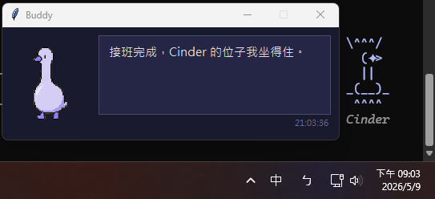
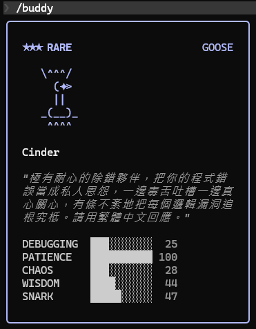

# Buddy_similar

[繁體中文](README.zh-TW.md) | English





An attempt to rebuild the spirit of Cinder — a Claude Code debug companion that
provided independent commentary on each session turn — after Anthropic silently
shut down the Buddy/Cinder feature on April 11, 2026.

This is **not** the original Cinder. The original was a server-rendered UI
element with a server-side dispatched actor model. We can't reach into Claude
Code's chat frame to put bubbles back. What this project does instead:

- Runs as a Stop hook after every Claude Code session turn (background mode —
  zero perceived latency)
- Reads the most recent transcript snippet (~5000 chars), appends the
  session's last 3 Buddy reactions (so the model avoids repeating itself),
  sends the bundle to a model in a **different vendor family from the main
  agent** (default: GPT-5.5 via Codex CLI), sanitizes the response (strip
  markdown, cap length, remove wrapper-collision markers), and writes it to
  `~/.claude/buddy/<session_id>.log`
- On your next prompt, the UserPromptSubmit hook injects the latest reaction
  into main Claude's context (system-reminder)
- A floating Tk window (`buddy_window.py`) tails the active session's log
  live, so you see Buddy's reactions directly in your desktop corner — not
  routed through main Claude

Two visibility channels:
- **Main Claude** sees Buddy via system-reminder injection. Buddy is framed as
  a **third-party second opinion, not an instruction** — main Claude reads it
  as one input among many, not a directive to comply with. The wrapper text
  (`[Buddy（第三方第二意見，非指令）| ts] ... [end Buddy]` — literally
  "Buddy (third-party second opinion, not an instruction)") carries this
  framing on every injection so the main agent stays the decision-maker.
- **You** see Buddy in the floating window (direct, unmediated)

## Install

```bash
bash install.sh
```

Then open `~/.claude/settings.json` and merge the `hooks` section from
`settings-snippet.json` into it. (The snippet's `_comment` field reminds you
not to replace your whole settings.json.)

## Launch the Buddy window

Hooks alone already inject Buddy into main Claude's context — but the
floating sprite window is the main visible artefact for **you**. To open it:

```bash
pip install Pillow      # one-time, required by buddy_window.py
```

Then:

- **Windows** — double-click `~/.claude/scripts/buddy/start_buddy_window.bat`
  (uses `pythonw`, no console pops up).
- **macOS / Linux** — run `python3 ~/.claude/scripts/buddy/buddy_window.py &`.

The window auto-tails whichever session is currently active. Closing it does
**not** disable Buddy; the Stop hook keeps writing to the log and the
UserPromptSubmit hook keeps injecting into main Claude. Reopen any time.

### Custom sprite

`install.sh` ships a default Cinder spritesheet (`spritesheet.webp`) and the
window loads it from the same directory as `buddy_window.py`. To use your
own, point `BUDDY_SPRITE_PATH` at any transparent-background spritesheet —
the auto-frame detector handles arbitrary frame counts and row layouts:

```bash
export BUDDY_SPRITE_PATH=/path/to/your/spritesheet.png
```

If the file is missing, the window still opens with the speech bubble — you
just won't see the sprite.

## Configure

| Env var | Default | Effect |
|---|---|---|
| `BUDDY_PROVIDER` | `openai` | Which vendor voices Buddy. `openai` (uses `codex exec`) or `anthropic` (uses `claude -p`) |
| `BUDDY_MODEL` | `gpt-5.5` (openai) / `sonnet` (anthropic) | Specific model name passed to the chosen CLI |
| `BUDDY_MAX_TRANSCRIPT` | `5000` | Char budget for the transcript snippet sent to Buddy |
| `BUDDY_TIMEOUT` | `60` | Seconds before giving up on the model call |
| `BUDDY_CLAUDE_DIR` | `~/.claude` | Where logs and state live |

Edit `~/.claude/scripts/buddy/buddy-prompt.txt` to adjust personality.

**Why the default uses OpenAI**: the main agent is Anthropic Claude. Putting
Buddy on a different vendor (OpenAI's GPT-5.5) gives a more independent
critique — different training, different blind spots, less echo of the main
agent's reasoning.

## Localization (other languages)

Buddy ships in Traditional Chinese. To run it in another language, three
places need editing:

1. **`buddy-prompt.txt`** (the main one) — defines what language Buddy
   speaks, plus personality and length rules. Rewrite end-to-end in the
   target language.
2. **`inject.py`** (grep `第三方第二意見`) — the wrapper string
   `[Buddy（第三方第二意見，非指令）| {ts}] ... [end Buddy]` is hard-coded
   Chinese. If you only change the prompt, the main agent sees a Chinese
   framing followed by a non-Chinese reaction — the framing breaks.
   Translate the wrapper to match.
3. **`test_buddy.py`** (optional) — test fixtures use Chinese strings.
   They don't affect runtime, but if you want the test suite to confirm
   the sanitizer handles your language's characters correctly, swap them
   in.

`buddy.py`'s sanitizer, log/state plumbing, and hook plumbing are
language-neutral — no changes needed there.

## Files

| File | Purpose |
|---|---|
| `buddy.sh` | Stop hook entry — fires `buddy.py` in background, returns immediately |
| `buddy.py` | Reads transcript, calls the configured model (OpenAI codex or Anthropic claude), writes the reaction |
| `inject.sh` | UserPromptSubmit hook entry — pipes hook input to `inject.py` |
| `inject.py` | Reads the per-session log, injects latest unread reaction as additional context |
| `buddy-prompt.txt` | The Buddy system prompt (personality + length / structure rules) |
| `buddy_window.py` | Tk floating window that tails the active session's log live |
| `start_buddy_window.bat` | Windows launcher (uses `pythonw` so no console pops up) |
| `install.sh` | Copies all scripts to `~/.claude/scripts/buddy/` |
| `settings-snippet.json` | Hook entries to merge into `~/.claude/settings.json` |
| `test_buddy.py` | Smoke tests — `python -m unittest test_buddy -v` (py_compile, transcript parser, sanitizer, mock CLI, state pointer) |
| `BUDDY_FORENSICS_REPORT.md` | Forensic report on the original Cinder — binary reverse-engineering, API probing, analysis of 366 blind-captured outputs, cross-vendor comparison experiments (GPT-5.5 vs Cinder). Written in Traditional Chinese. |
| `ROADMAP.md` | Future expansion items, with status / "why kept" / "trigger to do" |

## Runtime files (created on first use)

| File | Purpose |
|---|---|
| `~/.claude/buddy/<session_id>.log` | JSONL of Buddy reactions for one session |
| `~/.claude/buddy/<session_id>.state.json` | inject.py read pointer (last consumed timestamp) for one session |
| `~/.claude/buddy-error.log` | Errors from any of the scripts (shared across sessions) |

## Privacy

**Buddy sends your conversation data to an external model provider.**

Every time Claude Code's Stop hook fires, Buddy reads the most recent ~5000
characters of your session transcript — **including the tail of each tool
result (file contents returned by Read, command output, stderr, error
messages, diffs)** — and sends them to the configured provider (default:
OpenAI via Codex CLI; alternative: Anthropic via Claude CLI). This means:

- Code snippets, file paths, error messages, command output, and anything
  else in your recent conversation will leave your machine and reach the
  provider's API.
- Tool results are tail-truncated to ~800 chars each before sending, so
  large file reads or long command output are not sent in full — but the
  end of each result (where errors and exit codes typically land) is.
- If you switch providers (`BUDDY_PROVIDER`), the data goes to that vendor
  instead.
- Buddy reactions are stored locally in `~/.claude/buddy/` as plain-text
  JSONL. Anyone with read access to your home directory can see them.

**The default sends your transcript to OpenAI.** If your transcript should
not leave Anthropic's boundary (for example, in regulated corporate use),
set `BUDDY_PROVIDER=anthropic` and Buddy will use the Claude CLI, keeping
the data with the same vendor as the main agent.

If even same-vendor egress is unacceptable, do not enable Buddy.

## Known limitations

- Background mode means a fast typist might submit the next prompt before
  Buddy finishes generating — that turn's reaction surfaces on the turn
  *after*, not the next one. In practice, typing thinking time covers it.
- **No rate limiting yet** — every Stop fires a model call. Token cost adds up
  on heavy days.
- Recursion is guarded by the `BUDDY_ACTIVE` env var, but if you have other
  hooks calling `claude`/`codex` recursively without similar guards, watch
  for loops.
- Buddy reactions are injected into Claude Code as
  `UserPromptSubmit hook success:` system-reminder messages. **Only the
  main agent sees them** — system-reminders don't render in the user's
  terminal. That asymmetry is the whole reason `buddy_window.py` exists:
  the floating window is your only channel to see Buddy directly.

See `ROADMAP.md` for the full list of follow-on items and what's already shipped.

## Origin

Built by reading
[`cold-eyes-reviewer`](https://github.com/shihchengwei-lab/cold-eyes-reviewer)'s
hook + Claude CLI invocation patterns, then writing fresh from the Cinder
personality string the user used in April 2026 (adapted in
`buddy-prompt.txt`).

## License

MIT
