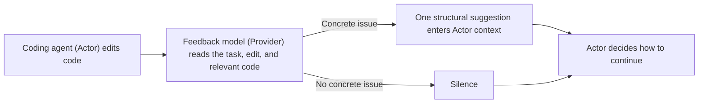

# Masters’ Nudge

English | [繁體中文](README.zh-TW.md)

> **Passing tests settles behavior, not design.**
>
> Green light means it passes now. What about six months later?

## How it works



## A real example

Express needed to support a custom view cache key, `cacheKey`. The coding agent wired the new key into cache reads and writes, but kept the cache as an ordinary object, `{}`. A name such as `toString` could then look like an existing cache entry because it is inherited from the object, even when nothing was stored under that key.

Masters’ Nudge returned:

```text
OBSERVED: cache['toString'] -> Function
VIOLATES: inherited key -> false hit
PREFER: cache := Object.create(null)
```

The agent changed the cache to `Object.create(null)`, which has no inherited entries. A separate implementation of the same task, without this feedback, kept `{}`. Both passed the task checks. Two judges who did not know which implementation used the tool preferred the changed structure. The [Round 8 benchmark report](benchmark/formal-v8/ROUND-8-REPORT.zh-TW.md) gives the conditions and the other cases.

Feedback changes the probabilities of the Actor’s next output; the tool aims to make stronger code structures more likely. The Actor decides whether to use a suggestion and owns implementation and verification. A turn stops after three suggestions or two silences; failures are shown separately. See the [behavior specification](SPEC.zh-TW.md) for the criteria and data flow.

## What the benchmark found

Round 8 compared six tasks twice each. Arm A received “請高品味的完成任務。” (“Complete the task with good engineering taste”) but no Provider; arm B used Masters’ Nudge. Both arms passed **9/12** formal task checks. Of eight pairs eligible for design review, **B won four and four tied**. B took about **50%** more total execution time and **77%** more non-cached input tokens.

One clap task had a mismatch between its wording and acceptance format, and two Vue CSS suggestions had timing problems. The results show structural improvements worth investigating, but do not yet establish whether the extra cost is worthwhile. See the [full report](benchmark/formal-v8/ROUND-8-REPORT.zh-TW.md). This round tested an unreleased prompt from a candidate branch, not the installed `0.6.0` release.

## Use and limits

Requires Python 3.10+, a Git workspace, a signed-in Codex Provider, and an Actor runtime with `UserPromptSubmit`, `PostToolUse`, and `turn_id`. The Provider currently supports OpenAI/Codex only. The tool needs the actual edit content; opaque shell writes are unsupported.

```powershell
python masters_nudge_cli.py provider get
python masters_nudge_cli.py provider set openai --model gpt-6-sol
python masters_nudge_cli.py doctor --host codex
python masters_nudge_cli.py recent-nudges --limit 10
```

Without a saved Provider selection, the code defaults to `gpt-5.6-sol` at medium reasoning. A saved selection overrides it. Round 8 used `gpt-6-sol` at medium reasoning. The plugin manifest version is `0.6.0+codex.20260922164420`.

Task text, edits, tool results, and repository code selected by the Provider are sent to OpenAI. The Provider can only read non-ignored workspace files; the tool does not edit the Actor’s files. Records are stored at `.masters-nudge/data/feedback.sqlite3` and settings at `.masters-nudge/config.json` under the user directory.

On Windows, interrupting a turn during synchronous `PostToolUse` can leave no matching `hook/completed` event, so the tool cannot tell whether that Hook finished. See [openai/codex#46765](https://github.com/openai/codex/issues/46765) for the reproduction and tracking.

## Development

Source files are the single implementation source; build commands generate the plugin copy:

```powershell
python tools/build_plugin.py --write
python tools/build_plugin.py --check
python -m unittest discover -s tests -v
```
