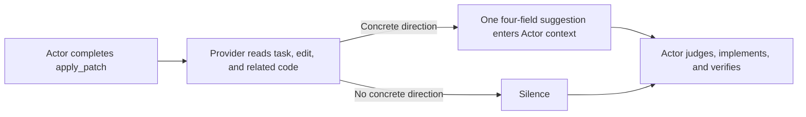

# Masters’ Nudge

English | [繁體中文](README.zh-TW.md)

> **Passing tests settles behavior, not design.**
>
> Green light means it passes now. What about six months later?

Masters’ Nudge asks a second model (the Provider) to read the task and code relations after the coding model (the Actor) completes an edit. It returns one short structural suggestion. The Actor decides whether to adopt it and owns implementation, verification, and complete delivery.

## How it works


```mermaid
flowchart LR
    A["Actor completes apply_patch"] --> B["Provider reads task, edit, and related code"]
    B -->|Concrete direction| C["One four-field suggestion enters Actor context"]
    B -->|No concrete direction| D["Silence"]
    C --> E["Actor judges, implements, and verifies"]
    D --> E
```

Within one call, the Provider first works backward from complete delivery to select a contract condition that could be missed. It then traces necessary responsibilities, data distinctions, and information to find relations currently maintained by workarounds, and proposes a structure that lets the required results hold naturally. Five criteria focus on invalid states, one-way causality, predictable behavior, one authoritative source, and boundaries and abstraction.

| Feedback field | Content | Character limit |
|---|---|---|
| `REQUIRED` | A checkable result selected from the task contract | 35 |
| `OBSERVED` | A short code anchor and the visible relation | 40 |
| `WHY` | The relation's possible impact on the task | 25 |
| `STRUCTURE` | An alternative data and responsibility relation supporting complete delivery | 61 |

The Provider writes `required` first. Actor-facing order is `OBSERVED → WHY → STRUCTURE → REQUIRED`. The four labeled fields, including line breaks, fit within 200 characters. The tool adds fixed guidance to check the contract, implement an adopted relation, and verify results.

A turn stops after three suggestions or two silences, whichever comes first. Recognized test-only edits are skipped without a Provider call or allowance use. The tool does not own acceptance or monitor removal of task-required tests. See the [behavior specification](SPEC.zh-TW.md) for responsibilities and data flow.

## A real example

The latest six-arm study's Element task required multi-device selection, a selection count, cancellation, and bulk sign-out. Compare **A1, direct implementation**, with **B1, using the tool**: both Actors used GPT-6.1 Sol medium, the same CLI, task, and base commit.

| | Without the tool: A1 | With the tool: B1 |
|---|---|---|
| Selection IDs and the method that updates them | Independently optional, with separate source selection | Both supplied or both omitted, with one source decision |
| Supplying only one half | The interface permits displaying external IDs while clicks update local IDs | The type excludes this combination; runtime also keeps reads and writes together |
| Complete-delivery judgment | Passed | Passed |

B1's first edit also selected read and write sources separately. The Provider's actual feedback was:

```text
OBSERVED: FilteredDeviceList: ids??local,set??own
WHY: 單邊 prop 可能使選取更新失效
STRUCTURE: selection props 成對或皆省略；同源讀寫→checked/count/signOut
REQUIRED: 選取、計數與批次登出使用同一組 IDs
```

The Actor then required both halves together and used one decision to choose their source. This makes a component call that displays one state but updates another invalid, without later synchronization or special-case repairs.

Both judges, with anonymous presentation order swapped, preferred B1. The difference is whether the component interface prevents split read/write ownership: both actual pages supplied the complete pair and both completed the contract. See the [case comparison](docs/examples/element-sessions.zh-TW.md) for original feedback, code, and judgment evidence; use the [six-arm report](benchmark/sol61-six-arm-20261002/REPORT.zh-TW.md) for overall benefits and costs.

## What the benchmark found

The latest retained complete comparison is the **six-arm study from September 30 to October 2, 2026**: 12 tasks, two attempts per task and arm, totaling 144 deliveries. Sol means GPT-6.1 Sol; Astra means GPT-6 Astra.

| Arm | Actor | Provider | Complete deliveries |
|---|---|---|---|
| A | Sol medium | None | 6/24 |
| B | Sol medium | Sol medium | 8/24 |
| C | Sol xhigh | None | 13/24 |
| D | Sol medium | Astra medium | 8/24 |
| E | Sol xhigh | Astra medium | 10/24 |
| F | Sol xhigh | Sol medium | 11/24 |

Complete delivery includes functionality, execution rules, the 30-minute deadline, and uniform compatibility checks for original requirements. Delivery count is **C > F > E > B = D > A**. Among jointly completed pairs, B beat A five to one; B versus C split four to four; F versus C split three to three with two ties. Pair populations differ, so these results cannot form an overall taste ranking.

B completed two more deliveries than A with better structural taste and about 14.2% more total time. F completed two fewer than C with tied taste and about 27.7% more time. Across the same 19 positions with complete usage records in all arms, B used about 88.9% more non-cached input than A; F used about 51.1% more than C. This study shows benefits with a medium Actor, and additional cost and deadline problems with an xhigh Actor. See the [complete report](benchmark/sol61-six-arm-20261002/REPORT.zh-TW.md) for CLI version differences, task results, and denominators.

The report, harness, and original evidence are included in this repo for [offline statistical reconstruction](benchmark/sol61-six-arm-20261002/HARNESS.zh-TW.md). The [benchmark index](benchmark/README.zh-TW.md) distinguishes earlier studies and versions. Later prompt changes for the three unsolved tasks were withdrawn and are outside the current prompt and effect evidence.

## Use and limits

Requires Python 3.10+, a Git workspace, an executable and signed-in Codex CLI, and an Actor runtime supporting `UserPromptSubmit`, synchronous MCP `PostToolUse`, and `turn_id`. The Provider supports OpenAI/Codex only. Edits are observed through explicit `apply_patch` event content; shell writes without edit content are unsupported.

From the repo root in PowerShell:

```powershell
python masters_nudge_cli.py provider get
python masters_nudge_cli.py provider set openai --model gpt-6.1-sol
python masters_nudge_cli.py doctor --host codex
python masters_nudge_cli.py recent-nudges --limit 10
```

The setting selects the Provider model; it does not change the Actor. Provider reasoning is fixed at medium in code. Without a saved model selection, the default is `gpt-5.6-sol`; saved settings override it. `doctor` checks dependencies, login, and plugin enablement; complete Hook delivery still requires a runtime test.

The repo plugin manifest version is `0.6.0+codex.20260925224104`. These docs describe the working tree and generated plugin; they do not establish that an installed copy, public release, or remote repo has been updated. See the [development guide](docs/DEVELOPMENT.zh-TW.md) for plugin entry points and workflow.

A recorded Windows interruption during synchronous `PostToolUse` lacked a matching `hook/completed` event. See [openai/codex#46765](https://github.com/openai/codex/issues/46765) for reproduction and tracking. This records the observed limitation rather than asserting the current upstream issue status.

## Privacy

Task text, edits, tool results, complete changed files that fit the shared material allowance, and file-origin facts are sent to OpenAI. The Provider may read non-ignored files in the Git workspace; it cannot edit the Actor's files. The full task-start file list stays local; only existence facts for paths in the current patch are sent. Unknown provenance remains unknown.

Records default to `.masters-nudge/data/feedback.sqlite3` and settings to `.masters-nudge/config.json` under the user directory. `MASTERS_NUDGE_DATA_DIR` can override these locations. Delivery receipts do not establish Actor adoption or task completion.

## Development

Source files are the single implementation source; build commands generate the plugin copy:

```powershell
python tools/build_plugin.py --write
python tools/build_plugin.py --check
python -m unittest discover -s tests -v
```

The [documentation index](docs/README.zh-TW.md) distinguishes current guidance from historical records.
