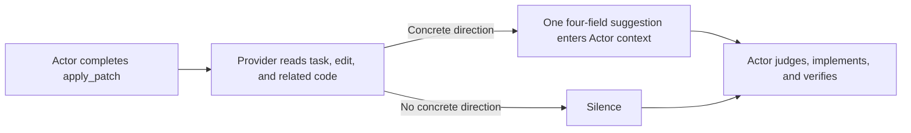

# Masters’ Nudge

English | [繁體中文](README.zh-TW.md)

> **Passing tests settles behavior, not design.**
>
> Green light means it passes now. What about six months later?

AI can implement a feature and pass its tests while the code still depends on synchronization, special branches, and local patches to stay correct. As requirements change, those workarounds can keep growing.

Masters’ Nudge aims to improve this: it adds a short structural suggestion while AI writes code, bringing an alternative data and responsibility arrangement into the next generation and making a better structure more likely.

## Results and costs

We compared direct implementation with structural feedback across **12 code-change tasks and seven model configurations**, measuring complete delivery, code structure, and cost. Each task was attempted twice per configuration, totaling 168 deliveries, from September 30 to October 4, 2026. Sol means GPT-6.1 Sol; Astra means GPT-6 Astra. Medium and xhigh are reasoning-depth settings. The coding model is the Actor; the feedback model is the Provider.

**The primary comparison covers nine tasks: 18 attempts per configuration, 126 total.** No implementation tested in the seven arms or subsequent dual-Astra-max explorations completed the full Regexp, Metaflow, or Tracing contract. The maintainer also confirmed that prior checks of the authors’ implementations did not satisfy the full contracts. These three tasks are published as [unresolved challenges](benchmark/unresolved-challenges-20261004/README.zh-TW.md); their six attempts per arm are excluded from primary completion and cost statistics. This is a post-study classification, not a preregistered exclusion. All original twelve-task results remain available. “Unresolved” does not establish impossibility or mean nobody elsewhere has solved them.

**A Sol xhigh Actor with a Sol xhigh Provider matched direct implementation on complete deliveries and improved structural taste, at a higher time and token cost.** It also improved completion and taste over the Sol medium Provider, with approximately 3.7% more total time. The observed comparisons are:

| Comparison | Taste: wins / losses / ties | Total time | Non-cached input tokens |
|---|---|---|---|
| B vs A: Sol medium + Sol medium vs direct | 5 / 1 / 0 | +24.3% | +84.2% |
| F vs C: Sol xhigh + Sol medium vs direct | 3 / 3 / 2 | +43.6% | +50.7% |
| I vs C: Sol xhigh + Sol xhigh vs direct | 7 / 0 / 4 | +48.9% | +74.3% |
| I vs F: Provider medium → xhigh | 5 / 0 / 4 | +3.7% | +15.7% |

Taste numbers are the final code-review assessments of 71 comparisons where both implementations completely delivered the same task and attempt position. The review weighed whole-flow maintenance cost, including added state, adapters, synchronization, and compatibility work; it was aware of the configurations. Time covers all 18 attempts per arm on the nine tasks; tokens include Actor and Provider usage at the same 16 positions with complete records across all seven arms. The unresolved tasks had no eligible taste pairs, so all 71 final comparisons are unchanged. I–F shares the same CLI; F/I versus C includes a CLI version difference. The report documents I's timeout and verification repairs, missing usage, and separately recorded overhead. These are structure, time, and usage measurements, not monetary bills.

Complete deliveries were:

| Configuration | Coding model | Feedback model | Complete deliveries |
|---|---|---|---|
| A | Sol medium | None | 6/18 |
| B | Sol medium | Sol medium | 8/18 |
| C | Sol xhigh | None | 13/18 |
| D | Sol medium | Astra medium | 8/18 |
| E | Sol xhigh | Astra medium | 10/18 |
| F | Sol xhigh | Sol medium | 11/18 |
| I | Sol xhigh | Sol xhigh | 13/18 |

Complete delivery includes functionality, execution rules, the 30-minute deadline, and uniform compatibility checks for original requirements. Delivery count is **C = I > F > E > B = D > A**. C has the best time per completed delivery; I improves reviewed taste without increasing the total completed count over C. No arm completed Metaflow, Tracing, or Regexp. Taste results cover direct comparisons with different jointly completed populations, so they cannot form an overall ranking.

See the [code-review results](benchmark/model-comparison-20261004/taste-review/README.zh-TW.md) for all final taste comparisons and their code evidence, and the [nine-task primary report](benchmark/model-comparison-20261004/PRIMARY.zh-TW.md) for task results, costs, and CLI version differences. The [methods and data](benchmark/README.zh-TW.md) explain how to audit tasks, code changes, acceptance checks, and judgments, and reconstruct statistics offline.

The [original twelve-task report](benchmark/model-comparison-20261004/REPORT.zh-TW.md) preserves historical statistics, individual results, and CLI differences.

## What the tool does

The coding model is the Actor; the feedback model is the Provider. After an Actor edit, the Provider reads the task and related code and returns one short structural suggestion. It enters the Actor's context automatically. The Actor decides whether to adopt it and continues implementation and verification.


```mermaid
flowchart LR
    A["Actor completes apply_patch"] --> B["Provider reads task, edit, and related code"]
    B -->|Concrete direction| C["One four-field suggestion enters Actor context"]
    B -->|No concrete direction| D["Silence"]
    C --> E["Actor judges, implements, and verifies"]
    D --> E
```

### A real example

The benchmark's Element task required multi-device selection, a selection count, cancellation, and bulk sign-out. Compare **A1, direct implementation**, with **B1, using the tool**: both Actors used GPT-6.1 Sol medium, the same CLI, task, and base commit.

| | Without the tool: A1 | With the tool: B1 |
|---|---|---|
| Selection IDs and the method that updates them | Independently optional, with separate source selection | Both supplied or both omitted, with one source decision |
| Supplying only one half | The interface permits displaying external IDs while clicks update local IDs | The type excludes this combination; runtime also keeps reads and writes together |
| Complete-delivery judgment | Passed | Passed |

B1's first edit also selected read and write sources separately. The Provider's actual feedback was:

```text
OBSERVED: FilteredDeviceList: ids??local,set??own
WHY: 單邊 prop 可能使選取更新失效
STRUCTURE: selection props 成對或皆省略；同源讀寫→checked/count/signOut
REQUIRED: 選取、計數與批次登出使用同一組 IDs
```

The Actor then required both halves together and used one decision to choose their source. This makes a component call that displays one state but updates another invalid, without later synchronization or special-case repairs.

The code review favored B1's structure: its component interface prevents split read/write ownership with a small constraint and no extra state or coordination. Both actual pages supplied the complete pair and both completed the contract. See the [case comparison](docs/examples/element-sessions.zh-TW.md) for feedback and code evidence; use the [code-review results](benchmark/model-comparison-20261004/taste-review/README.zh-TW.md) and [model configuration report](benchmark/model-comparison-20261004/REPORT.zh-TW.md) for overall benefits and costs.

## Why a nudge can help

The Actor's next generation is shaped by the task, existing code, and its preceding approach. When a problem appears, adding another condition or special case offers a readily available continuation of the same local repair path.

A nudge injects a concrete alternative data and responsibility arrangement into that context. Removing the need for a workaround through structure becomes another candidate direction for subsequent generation. The aim is to influence the Actor's next token choices and increase the probability of adopting a better structure.

The Provider uses five taste criteria to find that direction: make invalid states unrepresentable, keep causality one-way and behavior predictable, give facts one authoritative source, and keep necessary complexity at real boundaries. Suggestions name checkable alternative relations so the Actor can judge and implement them. See the [behavior specification](SPEC.zh-TW.md) for the two selection steps, four-field format, and character limits.

## Limitations

- The Actor owns complete delivery, evaluation of feedback, implementation, and verification. The tool does not take over acceptance.
- A turn stops after three suggestions or two silences, whichever comes first. Recognized test-only edits are skipped without a Provider call or allowance use.
- The Provider supports OpenAI/Codex only. Edits must arrive as explicit `apply_patch` content; opaque shell writes are unsupported.
- A recorded Windows interruption during synchronous `PostToolUse` lacked a matching `hook/completed` event. See the [reproduction and tracking](https://github.com/openai/codex/issues/46765).

## Requirements

Requires Python 3.10+, a Git workspace, an executable and signed-in Codex CLI, and an Actor runtime supporting `UserPromptSubmit`, synchronous MCP `PostToolUse`, and `turn_id`.

The repo plugin manifest version is `0.6.0+codex.20260925224104`. Provider reasoning is fixed at medium; the xhigh Provider in the comparison used an experimental setting, and there is no everyday reasoning-depth setting. Without a saved model selection, the default is `gpt-5.6-sol`. Saved selections override that default and do not change the Actor model.

## Install, enable, and try it

1. Make sure Python, Git, and Codex CLI are installed. If the CLI is not signed in, run `codex login` in PowerShell.
2. In the Codex desktop Plugins page, choose **Add → Add Marketplace → Add from a repository**, enter `https://github.com/shihchengwei-lab/masters-nudge`, and select **Sync**. The repo's [marketplace](.agents/plugins/marketplace.json) exposes Masters’ Nudge; open it, install it, and enable it. See the [official installation steps](https://developers.openai.com/learn/developers-codex-plugin).
3. Review and trust the plugin hooks when Codex prompts you. In the CLI, use `/hooks` to inspect Masters’ Nudge's `UserPromptSubmit` and `PostToolUse` hooks. Installation and enablement do not automatically trust hooks; see the [official hook guidance](https://learn.chatgpt.com/docs/hooks).
4. Open a new chat and ask Codex: “Check whether Masters’ Nudge is ready and set its Provider to gpt-6.1-sol.” The plugin supplies configuration and diagnostic skills; readiness reports dependencies, login, and enablement.
5. Start a new chat in your own Git project and give the Actor a normal code change. After a product-code `apply_patch`, ask Codex: “Show recent Masters’ Nudge attempts.” `feedback` means a suggestion was produced; `silence` means a successful judgment found no suggestion. Faults have separate reasons. For feedback, inspect the four-field suggestion in the Actor context and the subsequent code changes.

If you downloaded this repo, you can also configure and inspect the tool manually from its root in PowerShell:

```powershell
python masters_nudge_cli.py provider set openai --model gpt-6.1-sol
python masters_nudge_cli.py doctor --host codex
python masters_nudge_cli.py recent-nudges --limit 10
```

## Privacy

Task text, edits, tool results, complete changed files that fit the shared material allowance, and file-origin facts are sent to OpenAI. The Provider may read non-ignored files in the Git workspace; it cannot edit the Actor's files. The full task-start file list stays local; only existence facts for paths in the current patch are sent. Unknown provenance remains unknown.

Records default to `.masters-nudge/data/feedback.sqlite3` and settings to `.masters-nudge/config.json` under the user directory. `MASTERS_NUDGE_DATA_DIR` can override these locations. Delivery receipts do not establish Actor adoption or task completion.

## Development

Source files are the single implementation source; build commands generate the plugin copy:

```powershell
python tools/build_plugin.py --write
python tools/build_plugin.py --check
python -m unittest discover -s tests -v
```

See the [documentation index](docs/README.zh-TW.md) for usage, specifications, and development guidance.
