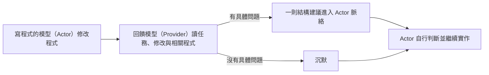

# Masters’ Nudge

繁體中文 | [English](README.md)

> **測試通過，只證明行為；不能證明設計。**
>
> 綠燈代表現在能過。六個月後呢？

## 它怎麼運作



## 看一個實際案例

Express 要支援自訂快取鍵 `cacheKey`。模型已把新鍵接上快取讀寫，但快取仍用一般物件 `{}`。這會讓 `toString` 這類物件繼承的名稱看起來像「已有快取」，即使程式從未存入該項目。

Masters’ Nudge 給出的回饋是：

```text
OBSERVED: cache['toString'] -> Function
VIOLATES: inherited key -> false hit
PREFER: cache := Object.create(null)
```

模型接著把快取改成沒有繼承屬性的 `Object.create(null)`。同題另一份沒有收到回饋的實作保留 `{}`。兩份實作都通過任務驗收；兩位不知道哪份使用工具的評審，都認為改後的結構較好。[第八輪 Benchmark 報告](benchmark/formal-v8/ROUND-8-REPORT.zh-TW.md)記錄了測試條件與其他案例。

回饋會影響 Actor 後續輸出的機率；工具的目標是提高高品味程式結構出現的機率。Actor 決定是否採納，也負責實作與驗證。每輪最多三次回饋或兩次沉默，故障會另行顯示。[完整行為規格](SPEC.zh-TW.md)說明判斷準則與資料流。

## 目前測到什麼

第八輪用六題、每題兩次比較：A 臂收到「請高品味的完成任務。」但沒有 Provider；B 臂啟用 Masters’ Nudge。兩臂各有 **9/12** 完成正式驗收。能比較設計的八組中，**B 勝四組、平手四組**；B 的總執行時間多約 **50%**，非快取輸入 Token 多約 **77%**。

其中 clap 題目的文字與驗收格式有歧義；兩次 Vue CSS 回饋的方向也有時序問題。這些結果顯示值得追查的結構改善，同時還不足以判定額外成本是否值得。詳見[正式報告](benchmark/formal-v8/ROUND-8-REPORT.zh-TW.md)。本輪測的是候選分支尚未發布的提示詞，不代表已安裝的 `0.6.0` 版本。

## 使用與限制

需要 Python 3.10+、Git 工作區、已登入的 Codex Provider，以及支援 `UserPromptSubmit`、`PostToolUse` 和 `turn_id` 的 Actor。Provider 目前只支援 OpenAI／Codex；工具必須能讀到實際修改內容，無法辨識內容的命令列寫檔不在支援範圍。

```powershell
python masters_nudge_cli.py provider get
python masters_nudge_cli.py provider set openai --model gpt-6-sol
python masters_nudge_cli.py doctor --host codex
python masters_nudge_cli.py recent-nudges --limit 10
```

程式碼未設定 Provider 模型時預設為 `gpt-5.6-sol`、medium reasoning；已儲存的設定會覆蓋預設。第八輪使用 `gpt-6-sol`、medium reasoning。插件清單版本為 `0.6.0+codex.20260922164420`。

任務、修改、工具結果及 Provider 選讀的程式碼會傳給 OpenAI。Provider 只能唯讀工作區中未被忽略的檔案；工具不修改 Actor 的檔案。紀錄存於使用者目錄的 `.masters-nudge/data/feedback.sqlite3`，設定存於 `.masters-nudge/config.json`。

Windows Codex 在同步 `PostToolUse` 期間若中斷該輪，可能缺少對應的 `hook/completed` 事件，讓工具無法判定 Hook 是否結束。重現與追蹤見 [openai/codex#46765](https://github.com/openai/codex/issues/46765)。

## 開發

原始碼是唯一實作來源，插件副本由建置指令產生：

```powershell
python tools/build_plugin.py --write
python tools/build_plugin.py --check
python -m unittest discover -s tests -v
```
