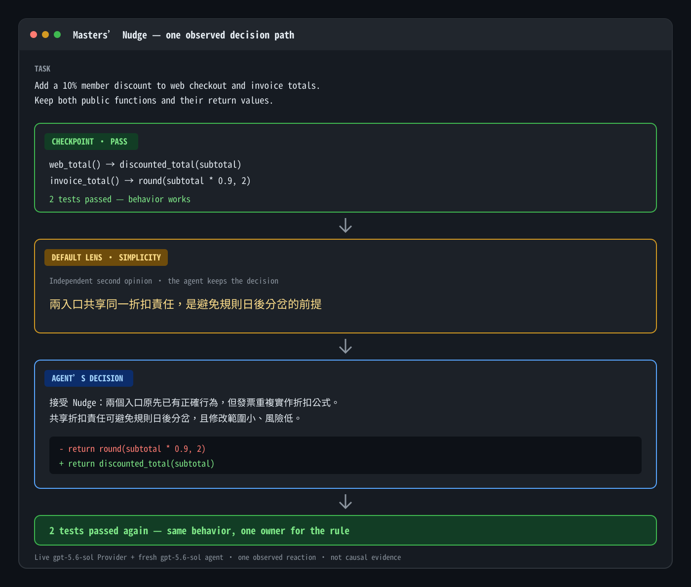
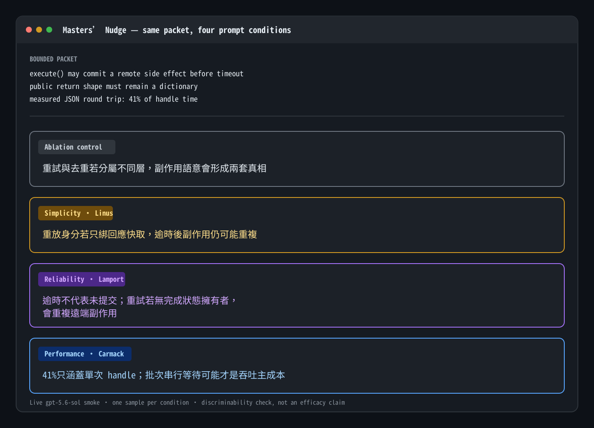

# Masters’ Nudge

繁體中文 | [English](README.md)

> **測試通過，只能確定行為；不能替 Agent 選擇設計。**

Masters’ Nudge 會在 Claude Code 或 Codex Agent 做下一個決定前，提供一則簡短、
有證據根據的工程視角。Masters’ Nudge 不會代替 Agent 解題或阻止 Agent 繼續，而是
指出主模型可能低估的工程關係。

## 看一則 Nudge 進入下一個決策



這次 controlled live smoke 從正常運作、兩項測試通過的程式開始。預設 Simplicity
Lens 使用目前發行的 Provider prompt 與注入標籤，把共用折扣責任表達為避免規則
分岔的條件。一個全新的主模型收到未經改寫的 Nudge，自行決定改用既有計算，並讓
相同兩項測試再次通過。

圖中保留完整 Nudge、主模型陳述的決策、實際一行 diff 與重跑結果。這只是一筆觀察，
不能證明是 Nudge 造成修改，也不保證另一次執行會得到相同結果。

## 看同一 packet 如何牽動 Lens 注意力



這不是介面示意圖，而是同一個模型針對同一份 bounded packet 進行的四次真實
Provider 呼叫。packet 同時呈現不確定重試、必須維持的回傳形狀，以及已量到的序列化
成本；四組只改變 Lens context，其中 control 不加入 Lens。

Control 與 Performance 都偏向移除已量到的序列化成本；Simplicity 與 Reliability
都把遠端重放去重視為安全重試的條件。這次樣本形成兩組注意力，並未得到四個完全
分離的答案。

圖中是每組一次呼叫的完整 Nudge。這個 smoke 只檢查 prompt 能否分開注意力，不能
證明準確率、重複穩定性，或 Nudge 對主模型的實際效果。

## 三個 Lens

Lens 就是觀察問題的角度。

| Lens | 關注什麼 |
|---|---|
| Simplicity | 不必要的複雜度，以及責任放錯地方 |
| Reliability | 事件換序、重試或中途失敗時，什麼仍必須成立 |
| Performance | 真實執行路徑上，哪些已量到的工作可以移除 |

選擇一個 Lens 後會持續使用，直到你主動更換。預設是 Simplicity，沒有 Automatic
Router。Checkpoint 通過呼叫資格時，選定的 Lens 只會呼叫 Provider 一次；資料不足以
支持有用的 Nudge 時，Provider 會回傳 `no_finding`。

Lens Prompt 裡的專家姓名只是注意力提示，不表示 Provider 取得該人物的能力，也不會
憑空讓 Nudge 更準確。

## 如何運作

```text
任務與目前 workspace
Agent 已看過的周圍原始碼
本次觸發呼叫的 checkpoint
            ↓
      一個選定的 Lens
            ↓
   一則短 Nudge，或保持沉默
            ↓
      Agent 的下一段脈絡
```

每次只會把一則 52 字內的繁體中文 Nudge 放進 Agent 的下一段脈絡。Nudge 會在選定的
工程理想下指出一個工程重點及其後果，讓下一個決策朝理想靠近；取捨與實作仍由
Agent 決定。理想是方向，不是終點。內容依目前情況生成，不是隨機抽一句罐頭訊息，
也不是 review、評分、問題或完整解法。

Claude Code 與受支援的 Codex build 都提供理想的 `PostToolBatch` 控制點：同一個
模型步驟的工具結果都完成後，下一步開始前才判斷。不提供此事件的 Codex build
不受這個版本支援。
Codex 目前沒有唯讀查詢 Hook capability 的指令，因此 plugin 已安裝不等於此事件
已驗證。Doctor 會把 Codex precision 回報為 `unverified`；是否 exact 必須另以隔離
smoke 確認。

修改會先記錄，留給下一次檢查判斷。本回合至少觀察到一次修改後，包含驗證、失敗或
量測的 `PostToolBatch` 才可能同步啟動 Nudge 流程。每個回合最多各有一次非失敗檢查
的候選機會與一次失敗機會，順序不限。每個通過資格的 checkpoint 都會消耗對應機會
並呼叫 Provider 一次，上限 90 秒；`no_finding` 也算已使用。Provider 回應越慢，
Agent 等待越久；發生錯誤或逾時時，這次 Nudge 直接結束，主要 Agent 照常繼續。

Provider packet 以目前 workspace 表示當前狀態，checkpoint 證據則只包含本次觸發
呼叫的 batch。更早的工具結果仍留在本機稽核狀態，不會重播給 Provider。Agent 先前
看過的原始碼節錄只提供額外的非權威脈絡；這些內容來自受長度限制且已扁平化的 Hook
output，可能漏掉關鍵 caller 或契約。Masters’ Nudge 不宣稱能重建完整的 repository
review。

## 隱私

### 哪些資料會離開電腦

選定的 Provider 會收到一份受長度限制的資料，可能包含：

- 目前任務，或從長任務找回的 Goal；
- 任務明確指定的本機檔案內容，只在任務開始時讀取一次；
- 目前已由 Git 追蹤、但尚未提交之變更的節錄，可能包含目前任務以外的檔案；
- 最多三個未被 Git 排除之未追蹤檔案的部分內容；
- 從 Agent 已看過的原始碼 navigation 結果中選出的節錄；
- 本次觸發呼叫之 batch 的驗證、失敗與量測；
- 沒有 authoritative Git workspace snapshot 時，本次 batch 的 change；
- 用來避免重複相同 tradeoff 的先前 Nudge；
- 與上述節錄及目前 checkpoint 相連、經長度限制的命令與結果。

Provider 不會收到完整對話或模型未公開的內部思考；系統也不會自動傳送完整
repository。

Anthropic 與 OpenAI 是雲端 Provider，這份資料會離開你的電腦，並受該 Provider
的資料政策約束。如果資料不能離開電腦，請選本機 Ollama。Ollama 只允許連到本機
位址，使用已安裝的模型，也不會失敗後偷偷改送雲端。

## 本機紀錄

Masters’ Nudge 會把目前任務狀態與少量稽核紀錄存在
`~/.masters-nudge/data/`。稽核紀錄包含 Nudge 回傳給 Host 的時間、使用的 Lens 與
Nudge 內容。

這只能證明 Hook 已把 Nudge 回傳給 Claude Code 或 Codex，不能證明主模型真的讀到、
採納，或因為 Nudge 才採取後續行動。

每次開始新任務時，系統會刪除超過 30 天沒有更新的工作階段資料。Provider 與 Lens
偏好另外存在 `~/.masters-nudge/config.json`，會保留到你再次修改。

## 支援的 Provider

- Anthropic
- OpenAI
- 本機 Ollama

每次 Nudge 只會使用一個已選定的 Provider，不會在失敗後偷偷換另一個。

## 安裝

需求：

- 支援 Plugin 的 Claude Code 或 Codex CLI；
- Python 3.10+；
- 已登入 Anthropic 或 OpenAI 對應的 CLI，或已啟動 Ollama 並先安裝要使用的模型。

### Claude Code

```bash
claude plugin marketplace add shihchengwei-lab/masters-nudge
claude plugin install masters-nudge@masters-nudge --config python_command=python
```

若 `python` 不是 Python 3.10+，請把 `python_command` 改成 `python3` 或合適 Python
執行檔的絕對路徑；不要附加其他命令參數。

### Codex

```bash
codex plugin marketplace add shihchengwei-lab/masters-nudge
codex plugin add masters-nudge@masters-nudge
```

安裝後請開啟新任務。在 Codex 中開啟 `/hooks`，檢查並批准 Plugin 命令。

### 更新或移除

```bash
# Claude Code
claude plugin marketplace update masters-nudge
claude plugin update masters-nudge@masters-nudge
claude plugin uninstall masters-nudge@masters-nudge

# Codex
codex plugin marketplace upgrade masters-nudge
codex plugin add masters-nudge@masters-nudge
codex plugin remove masters-nudge@masters-nudge
```

更新後請重新啟動 Host。解除安裝不會刪除既有本機資料。

## 直接請 Agent 操作

Hooks 會自動執行。需要手動操作時，直接用白話告訴 Agent：

- **「檢查 Masters’ Nudge 是否準備完成。」** 檢查 Python、Provider 存取、資料
  儲存與 Host Hooks，不會產生 Nudge。
- **「切換 Masters’ Nudge Lens。」** 用白話列出 Simplicity、Reliability、
  Performance，再確認保存後的選擇。
- **「切換 Masters’ Nudge Provider。」** 列出 Anthropic、OpenAI、本機 Ollama；
  設定 Ollama 時會確認已安裝的模型與本機服務。
- **「顯示最近的 Masters’ Nudge 紀錄。」** 用白話解釋近期稽核紀錄。

Skills 會在背後呼叫只輸出 JSON 的命令，再把結果翻成白話。使用者不用修改環境變數、
記住確切名稱，也不用看懂原始 JSON。

## 開發

Repository 原始碼是唯一實作來源；版控中的 Plugin 套件由原始碼產生。

```bash
python -m unittest discover -v
python tools/build_plugin.py --check
```

授權：[MIT](LICENSE)
