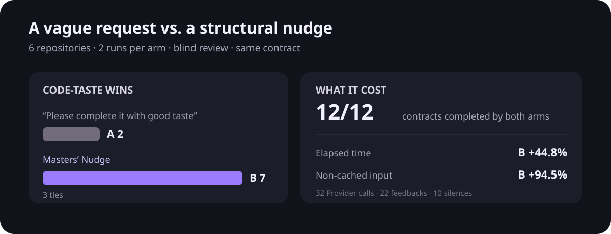

# Masters’ Nudge

繁體中文 | [English](README.md)

> **測試通過，只證明行為；不能證明設計。**
>
> 綠燈代表現在能過。六個月後呢？

### 一次真實勝場：Vue compiler 泛型解析

任務要求 Vue compiler 支援交集型別中的泛型參數。兩臂都通過同一份契約，但結構不同。

**A｜只有「請高品味的完成任務」：直接改寫共享 AST 節點**

```ts
;(type as ScopeTypeNode)._ownerScope = scope
genericScope.types[param.name] = type as ScopeTypeNode
```

**B｜Masters’ Nudge：為本次泛型實例建立自己的節點**

```ts
genericScope.types[param.name] = {
  ...type,
  _ownerScope: typeArgumentScope
} as ScopeTypeNode
```

B 的初稿也曾直接改寫共享節點。Provider 指出 `createTypeScope` 把呼叫端的所有權寫進共享 AST；Actor 收到反饋後，最終改成複製節點再附加作用域。另一次泛型解析因此無法再透過同一個 type argument 節點覆寫本次綁定的 `_ownerScope`。

> **盲評 1：**「B 將泛型引數複製後附加 `_ownerScope`；A 直接改寫原始 AST 引數節點，使共用節點的作用域受解析過程影響，增加隱藏副作用與更新順序依賴。」
>
> **盲評 2：**「B 將此次綁定的修改限制在新節點上，較符合局部可預測性與單向資料流。」

這組完整判讀與其他十一組評語都保留在[第六輪 Benchmark 報告](benchmark/formal-v6/RESULTS.zh-TW.md#各組盲評)。

下面是六題、十二組配對的完整結果。



同一批六個 repository 任務、同一個模型、同一份契約。A 臂只多一句「請高品味的完成任務」；B 臂不說這句，改由 Masters’ Nudge 在修改後提供具體的結構反饋。**B 以 7：2 勝出，3 組平手，兩臂契約皆為 12/12。**B 多花 44.8% 時間與 94.5% 非快取輸入 Token。

Masters’ Nudge 在執行者修改程式之後提供一則小幅反饋，讓執行者重新判斷資料關係，而不接管實作。
目前插件版本是 `0.6.0+codex.20260922164420`，工具規格以 [SPEC.zh-TW.md](SPEC.zh-TW.md) 為準；
[第六輪 Benchmark](benchmark/formal-v6/RESULTS.zh-TW.md) 是目前的效果證據。

每次 `apply_patch` 成功後，原生 PostToolUse 會同步呼叫常駐的 Codex 接入 MCP 工具
`review_patch`，由核心把任務、這次修改、成功結果及修改後工作區組成一次判斷。OpenAI／Codex Provider
依六條結構準則查看材料；現有事實不足時，Provider 才透過另一個唯讀 repository MCP 自行搜尋或讀檔。
有反饋時，工具保留原本的成功工具結果，再把 `OBSERVED`、`VIOLATES`、`PREFER` 三欄附在同一則結果後面，並要求執行者先判斷目前做法是否為任務必要。執行者仍決定是否採納建議，並負責實作及驗證。

每輪最多三次反饋或兩次沉默；任一上限到達便停止。使用者新訊息重置額度，衝突要求以最新的為準。
正常但沒有具體疑點時沉默。工具錯誤另外顯示「本輪反饋未執行」，不冒充沉默，不計入額度。

## 支援範圍

- Python 3.10+、Git 工作區、已登入的 Codex Provider。
- Actor 需使用能提供 UserPromptSubmit、PostToolUse 與 turn_id 的 Codex。
- Provider 僅 OpenAI／Codex，沒有其他供應商的替代路徑。
- Codex 接入 MCP 只公開 `review_patch`；Provider 唯讀 MCP 只允許工作區文字搜尋與範圍讀檔，本批材料與後續讀取共用容量限制。
- 工具輸入必須有完整修改文字、差異或路徑與寫入內容。看不出修改內容的命令列寫檔不在支援範圍。

## 已知限制

Windows 上的 Codex 若在同步 `PostToolUse` 執行期間中斷該輪，可能已送出 `hook/started`，卻沒有同一執行序號的
`hook/completed`。Masters’ Nudge 因而無法只靠事件判斷該次 Hook 已取消或仍在執行；這不是 Provider 沉默。
最小重現、事件順序與期望行為已提交至 [openai/codex#46765](https://github.com/openai/codex/issues/46765)，目前仍待 Codex 執行層修復。
本地重現紀錄見 [Codex PostToolUse 生命週期規格](experiments/champion-vs-preserved-result-20260920/CODEX-POSTTOOLUSE-LIFECYCLE-SPEC.md)。

## 證據範圍

Benchmark 使用六個 repository 任務，每題每臂各跑兩次。兩位冷啟動評審先取得相同的六條品味定義，再交換候選順序盲評；意見相左才啟用第三位。這份結果支持「Masters’ Nudge 讓同一模型更常選到較好的結構」；單一 Nudge 的效果不在這份結果的證明範圍內。完整方法、十二組解盲評語、成本及限制見[第六輪 Benchmark 報告](benchmark/formal-v6/RESULTS.zh-TW.md)。

目前原始碼與產生的插件副本一致。實際安裝狀態、不同 Codex 版本的事件行為，以及更新已安裝插件後的新任務完整流程，
仍須在目標環境另外確認，不能由單元測試代替。

## 設定與紀錄

```powershell
python masters_nudge_cli.py provider get
python masters_nudge_cli.py provider set openai --model gpt-5.6-sol
python masters_nudge_cli.py doctor --host codex
python masters_nudge_cli.py recent-nudges --limit 10
```

紀錄預設保存在使用者目錄下的 .masters-nudge/data/feedback.sqlite3，設定另存在 .masters-nudge/config.json。
紀錄包含材料、判斷、錯誤與有提供時的用量；送出反饋不代表執行者採納。

## 隱私

任務、修改、工具結果及 Provider 自行選讀的檔案內容會傳給 OpenAI。
Provider 唯讀 MCP 禁止讀取工作區外、Git 內部及被忽略的檔案。工具不修改執行者的檔案。

## 開發

原始碼是唯一實作來源，插件副本由既有建置指令產生。

```powershell
python tools/build_plugin.py --write
python tools/build_plugin.py --check
python -m unittest discover -s tests -v
```
