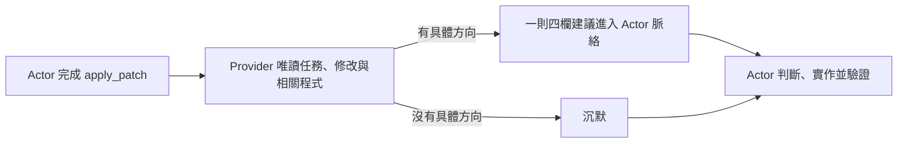

# Masters’ Nudge

繁體中文 | [English](README.md)

> **測試通過，只證明行為；不能證明設計。**
>
> 綠燈代表現在能過。六個月後呢？

Masters’ Nudge 在寫程式的模型（Actor）完成修改後，讓另一個模型（Provider）唯讀檢查任務與程式關係，提出一則簡短的結構建議。Actor 決定是否採納，並負責實作、驗證與完整交付。

## 它怎麼運作


```mermaid
flowchart LR
    A["Actor 完成 apply_patch"] --> B["Provider 唯讀任務、修改與相關程式"]
    B -->|有具體方向| C["一則四欄建議進入 Actor 脈絡"]
    B -->|沒有具體方向| D["沉默"]
    C --> E["Actor 判斷、實作並驗證"]
    D --> E
```

Provider 在一次呼叫內做兩步判斷：先從完整交付結果回推容易漏掉的契約條件；再從必要責任、資料區別與資訊，找出目前靠補救維持正確的關係，提出讓要求自然成立的結構方向。五條準則聚焦非法狀態、單向因果、可預測行為、單一事實來源，以及邊界與抽象。

| 回饋欄位 | 內容 | 字元上限 |
|---|---|---|
| `REQUIRED` | 從任務契約選出的可檢查結果 | 35 |
| `OBSERVED` | 簡短程式位置或識別字，以及可見關係 | 40 |
| `WHY` | 該關係對任務的可能影響 | 25 |
| `STRUCTURE` | 支持完整交付的替代資料與責任關係 | 61 |

Provider 先填 `required`；交給 Actor 時依 `OBSERVED → WHY → STRUCTURE → REQUIRED` 顯示。四欄含標籤與換行最多 200 字元，工具另附固定文字，引導 Actor 核對契約、實作採納的關係並驗證結果。

每輪最多三則建議或兩次沉默，先到任一上限就停止。可辨識的純測試修改直接略過，不呼叫 Provider、不耗額度。工具不接管驗收，也不監看是否刪除了任務要求的測試。完整責任與資料流見[行為規格](SPEC.zh-TW.md)。

## 一個實際案例

最新六臂測試的 Element 題要求支援多裝置勾選、選取數量、取消與一次批次登出。以下比較 **A1 直接做**與 **B1 加工具**：Actor 都是 GPT-6.1 Sol medium，使用相同 CLI、任務與基底。

| | 沒有工具：A1 | 加上工具：B1 |
|---|---|---|
| 勾選清單與修改清單的方法 | 各自可選，各自決定讀寫來源 | 必須成對提供或全部省略，一起決定讀寫來源 |
| 只提供一半時 | 介面容許畫面讀外部清單，點擊卻修改本地清單 | 型別排除這種組合，執行時也讓讀寫同源 |
| 本輪完整交付判定 | 通過 | 通過 |

B1 第一份修改也把讀寫來源分開選。Provider 提醒：

```text
OBSERVED: FilteredDeviceList: ids??local,set??own
WHY: 單邊 prop 可能使選取更新失效
STRUCTURE: selection props 成對或皆省略；同源讀寫→checked/count/signOut
REQUIRED: 選取、計數與批次登出使用同一組 IDs
```

Actor 接著約束兩者成對，並用同一個判斷決定來源。這讓「畫面看一份、點擊改另一份」的組合無法合法傳入元件；不用等接錯後再補同步或特殊處理。

兩位交換匿名順序的評審都偏好 B1。這組差別是元件介面能否防止讀寫來源分離；實際頁面兩份都成對傳入，也都完成契約。原始建議、前後程式與評審依據見[案例對照](docs/examples/element-sessions.zh-TW.md)，整體收益與成本仍看[六臂完整報告](benchmark/sol61-six-arm-20261002/REPORT.zh-TW.md)。

## 目前測到什麼

最新保留的完整比較是 **2026-09-30 至 10-02 的六臂測試**：12 題、每題每臂兩次，共 144 份交付。Sol 指 GPT-6.1 Sol，Astra 指 GPT-6 Astra。

| 臂 | Actor | Provider | 完整交付 |
|---|---|---|---|
| A | Sol medium | 無 | 6/24 |
| B | Sol medium | Sol medium | 8/24 |
| C | Sol xhigh | 無 | 13/24 |
| D | Sol medium | Astra medium | 8/24 |
| E | Sol xhigh | Astra medium | 10/24 |
| F | Sol xhigh | Sol medium | 11/24 |

完整交付包含功能、執行規則、30 分鐘時限及相同原條款的相容性補查。完成份數為 **C > F > E > B = D > A**。共同完成的程式碼品味：B 對 A 五勝一敗；B 對 C 四勝四敗；F 對 C 三勝三敗、兩組持平。各組樣本不同，不能串成總品味排名。

B 比 A 多完成兩份、結構品味較佳，累計時間多約 14.2%。F 比 C 少完成兩份、品味持平，時間多約 27.7%。六臂共同 19 個有完整用量的位置中，B 比 A 的未快取輸入多約 88.9%，F 比 C 多約 51.1%。這批結果支持 medium Actor 加工具的收益，也顯示 xhigh Actor 加工具的額外成本與收尾問題。CLI 版本差異、逐題結果與全部分母見[完整報告](benchmark/sol61-six-arm-20261002/REPORT.zh-TW.md)。

報告、測試 harness 與原始證據已收入 repo，可[離線重建統計](benchmark/sol61-six-arm-20261002/HARNESS.zh-TW.md)。較早結果與版本定位見[測試索引](benchmark/README.zh-TW.md)。三道難題的後續提示改寫已撤回，不屬現行提示或效果依據。

## 使用與限制

需要 Python 3.10+、Git 工作區、可啟動且已登入的 Codex CLI，以及支援 `UserPromptSubmit`、同步 MCP `PostToolUse` 和 `turn_id` 的 Actor 執行環境。Provider 目前只支援 OpenAI／Codex。只辨識事件中的明確 `apply_patch` 修改，無法觀察沒有提供修改內容的命令列寫檔。

從 repo 根目錄使用 PowerShell：

```powershell
python masters_nudge_cli.py provider get
python masters_nudge_cli.py provider set openai --model gpt-6.1-sol
python masters_nudge_cli.py doctor --host codex
python masters_nudge_cli.py recent-nudges --limit 10
```

設定只選 Provider 模型，不會更換 Actor。Provider 深度由程式固定為 medium；未設定模型時預設 `gpt-5.6-sol`，已儲存設定覆蓋預設。`doctor` 檢查依賴、登入與外掛啟用狀態；完整 Hook 送達仍需實測。

本 repo 外掛清單版本為 `0.6.0+codex.20260925224104`。目前文件描述工作樹與生成外掛，不代表已安裝副本、公開版本或遠端 repo 已更新。外掛入口與開發流程見[開發說明](docs/DEVELOPMENT.zh-TW.md)。

Windows 同步 `PostToolUse` 期間若中斷該輪，既有重現曾缺少對應的 `hook/completed`。重現與追蹤見 [openai/codex#46765](https://github.com/openai/codex/issues/46765)；此處記錄已觀察的限制，不宣告目前上游處理狀態。

## 隱私

任務原文、修改、工具結果、可完整放入共同材料額度的已修改檔案，以及檔案來源事實會傳給 OpenAI。Provider 可唯讀 Git 工作區中的未忽略檔案，不能修改 Actor 檔案。完整任務起點檔案清單只保存在本機，送出時只附本批路徑是否原本存在；未知來源保持未知。

預設紀錄存於使用者目錄的 `.masters-nudge/data/feedback.sqlite3`，設定存於 `.masters-nudge/config.json`。`MASTERS_NUDGE_DATA_DIR` 可覆蓋位置。紀錄有送達資訊，但送達不等於 Actor 採納或完成任務。

## 開發

原始碼是唯一實作來源，外掛副本由建置指令產生：

```powershell
python tools/build_plugin.py --write
python tools/build_plugin.py --check
python -m unittest discover -s tests -v
```

文件入口與現行／歷史分類見[文件索引](docs/README.zh-TW.md)。
