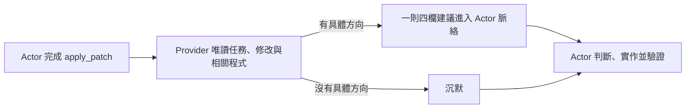

# Masters’ Nudge

繁體中文 | [English](README.md)

> **測試通過，只證明行為；不能證明設計。**
>
> 綠燈代表現在能過。六個月後呢？

AI 可以把功能做出來、讓測試通過，程式結構卻仍靠同步、特殊分支與局部補丁維持正確。需求再變，這些補救也可能繼續增加。

Masters’ Nudge 想改善這個問題：在 AI 寫程式的過程中，加入一則高品味結構的提醒，讓另一種資料與責任安排進入後續思考，增加產生更好結構的機會。

## 效果與代價

我們用 **12 道程式修改任務、七種模型配置**，比較直接實作與加入結構提醒的完成度、程式結構及成本。每題每配置各跑兩次，共 168 份交付；測試日期為 2026-09-30 至 10-04。Sol 指 GPT-6.1 Sol，Astra 指 GPT-6 Astra；medium 與 xhigh 是不同的思考深度。寫程式的模型稱為 Actor，提供提醒的模型稱為 Provider。

**Sol xhigh Actor 搭配 Sol xhigh Provider，完成率與直接做持平、結構品味提高，代價是更多時間與 Token。** 相對 Sol medium Provider，完成與品味也改善，時間相近。各組結果如下：

| 比較條件 | 前者品味：勝／敗／持平 | 累計時間 | 未快取輸入 Token |
|---|---|---|---|
| B 對 A：Sol medium＋Sol medium 對直接做 | 5／1／0 | +14.2% | +88.9% |
| F 對 C：Sol xhigh＋Sol medium 對直接做 | 3／3／2 | +27.7% | +51.1% |
| I 對 C：Sol xhigh＋Sol xhigh 對直接做 | 7／0／4 | +26.9% | +73.1% |
| I 對 F：Provider medium→xhigh | 5／0／4 | −0.6% | +14.5% |

品味採用程式碼覆核的最終結果，範圍為雙方完整交付的同題／同次序，共 71 組比較。覆核已知配置，將新增狀態、轉接、同步與相容處理一起納入完整流程的維護成本。時間涵蓋每臂全部 24 次嘗試，Token 使用七臂共同 19 個有完整用量的位置。I–F 使用相同 CLI，F/I 對 C 含 CLI 版本差異；I 的逾時與驗收修復、缺失用量及另列耗時見報告。這裡呈現的是結構品質、時間與用量，並非金額帳單。

完整交付結果如下：

| 配置 | 寫程式的模型 | 提供提醒的模型 | 完整交付 |
|---|---|---|---|
| A | Sol medium | 無 | 6/24 |
| B | Sol medium | Sol medium | 8/24 |
| C | Sol xhigh | 無 | 13/24 |
| D | Sol medium | Astra medium | 8/24 |
| E | Sol xhigh | Astra medium | 10/24 |
| F | Sol xhigh | Sol medium | 11/24 |
| I | Sol xhigh | Sol xhigh | 13/24 |

完整交付包含功能、執行規則、30 分鐘時限及相同原條款的相容性補查。完成份數為 **C = I > F > E > B = D > A**。時間效率以 C 最佳；I 的結構品味較好，沒有再提高相對 C 的完成總數。Metaflow、Tracing、Regexp 仍沒有任何一臂完成。品味只列直接比較，各組共同完成樣本不同，不能串成總排名。

最終品味評比與程式依據見[程式碼覆核報告](benchmark/model-comparison-20261004/taste-review/README.zh-TW.md)；逐題完成、成本與執行檔版本差異見[模型配置對比報告](benchmark/model-comparison-20261004/REPORT.zh-TW.md)。[測試方法與數據](benchmark/README.zh-TW.md)說明如何查驗題目、程式修改、驗收與評審紀錄，並離線重建統計。

## 工具做了什麼

寫程式的模型稱為 Actor，提供提醒的模型稱為 Provider。Actor 完成一次修改後，Provider 唯讀檢查任務與相關程式，提出一則簡短的結構建議；建議自動進入 Actor 的上下文，Actor 決定是否採納並繼續實作與驗證。


```mermaid
flowchart LR
    A["Actor 完成 apply_patch"] --> B["Provider 唯讀任務、修改與相關程式"]
    B -->|有具體方向| C["一則四欄建議進入 Actor 脈絡"]
    B -->|沒有具體方向| D["沉默"]
    C --> E["Actor 判斷、實作並驗證"]
    D --> E
```

### 一個實際案例

Benchmark 的 Element 題要求支援多裝置勾選、選取數量、取消與一次批次登出。以下比較 **A1 直接做**與 **B1 加工具**：Actor 都是 GPT-6.1 Sol medium，使用相同 CLI、任務與基底。

| | 沒有工具：A1 | 加上工具：B1 |
|---|---|---|
| 勾選清單與修改清單的方法 | 各自可選，各自決定讀寫來源 | 必須成對提供或全部省略，一起決定讀寫來源 |
| 只提供一半時 | 介面容許畫面讀外部清單，點擊卻修改本地清單 | 型別排除這種組合，執行時也讓讀寫同源 |
| 完整交付判定 | 通過 | 通過 |

B1 第一份修改也把讀寫來源分開選。Provider 提醒：

```text
OBSERVED: FilteredDeviceList: ids??local,set??own
WHY: 單邊 prop 可能使選取更新失效
STRUCTURE: selection props 成對或皆省略；同源讀寫→checked/count/signOut
REQUIRED: 選取、計數與批次登出使用同一組 IDs
```

Actor 接著約束兩者成對，並用同一個判斷決定來源。這讓「畫面看一份、點擊改另一份」的組合無法合法傳入元件；不用等接錯後再補同步或特殊處理。

程式碼覆核判定 B1 的結構較好：用很小的介面約束防止讀寫來源分離，沒有增加另一份狀態或協調流程。實際頁面兩份都成對傳入，也都完成契約。建議與前後程式見[案例對照](docs/examples/element-sessions.zh-TW.md)，整體收益與成本見[程式碼覆核報告](benchmark/model-comparison-20261004/taste-review/README.zh-TW.md)與[模型配置對比報告](benchmark/model-comparison-20261004/REPORT.zh-TW.md)。

## 作用原理

Actor 的後續生成受任務、既有程式與前面的解題脈絡影響。遇到問題時，沿著原本方向加一個判斷或特例，是一條容易延續的局部修補路徑。

Nudge 把另一種具體的資料與責任安排注入上下文，讓「從結構上消除補救」也成為後續生成的候選方向。它希望影響 Actor 接下來選中的 token，提高採用更好結構的機率。

Provider 用五條品味準則尋找這種方向：讓非法狀態無法表達、保持單向因果與可預測行為、讓事實只有一個權威來源，以及把必要複雜度留在真正的邊界。提醒聚焦可檢查的替代關係，讓 Actor 能判斷並實作。兩步選題、四欄格式與字元額度見[行為規格](SPEC.zh-TW.md)。

## 限制

- Actor 負責完成任務、判斷提醒、實作與驗證；工具不接管驗收。
- 每輪最多三則建議或兩次沉默，先到任一上限就停止。可辨識的純測試修改直接略過，不呼叫 Provider、不耗額度。
- Provider 只支援 OpenAI／Codex。只觀察明確的 `apply_patch` 修改，無法觀察沒有提供修改內容的命令列寫檔。
- Windows 同步 `PostToolUse` 期間中斷該輪，既有重現曾缺少對應的 `hook/completed`；詳見[重現與追蹤](https://github.com/openai/codex/issues/46765)。

## 環境需求

需要 Python 3.10+、Git 工作區、可啟動且已登入的 Codex CLI，以及支援 `UserPromptSubmit`、同步 MCP `PostToolUse` 與 `turn_id` 的 Actor 執行環境。

本 repo 外掛清單版本為 `0.6.0+codex.20260925224104`。Provider 深度固定 medium；測試中的 xhigh Provider 使用實驗設定，尚無日常深度設定介面。未設定模型時預設 `gpt-5.6-sol`，儲存的模型選擇覆蓋預設。Provider 設定不會更換 Actor 模型。

## 安裝、啟用與第一次使用

1. 確認 Python、Git 與 Codex CLI 已安裝；若 CLI 尚未登入，在 PowerShell 執行 `codex login`。
2. 在 Codex 桌面版的外掛頁，選 **Add → Add Marketplace → Add from a repository**，填入 `https://github.com/shihchengwei-lab/masters-nudge`，按 **Sync**。repo 的[外掛目錄](.agents/plugins/marketplace.json)提供 Masters’ Nudge；開啟它並安裝、啟用。來源與安裝介面可參照[官方步驟](https://developers.openai.com/learn/developers-codex-plugin)。
3. 依 Codex 的提示檢查並信任外掛 Hook。CLI 可輸入 `/hooks`，核對 Masters’ Nudge 的 `UserPromptSubmit` 與 `PostToolUse`；安裝與啟用不會自動完成 Hook 信任，詳見[官方 Hook 說明](https://learn.chatgpt.com/docs/hooks)。
4. 開啟新對話，請 Codex：「檢查 Masters’ Nudge 是否已就緒，並將 Provider 設為 gpt-6.1-sol。」外掛提供設定與診斷技能；就緒檢查會列出依賴、登入與啟用狀態。
5. 在自己的 Git 專案開啟新對話，交給 Actor 一項正常的程式修改。完成一次產品程式的 `apply_patch` 後，請 Codex：「顯示 Masters’ Nudge 最近的提醒紀錄。」`feedback` 表示已產生建議，`silence` 表示正常判斷後沒有建議；工具故障會另列原因。若有建議，可核對 Actor 上下文中的四欄提醒與後續程式改動。

如果已下載本 repo，也可在 repo 根目錄用 PowerShell 手動設定與查詢：

```powershell
python masters_nudge_cli.py provider set openai --model gpt-6.1-sol
python masters_nudge_cli.py doctor --host codex
python masters_nudge_cli.py recent-nudges --limit 10
```

## 隱私

任務原文、修改、工具結果、可完整放入共同材料額度的已修改檔案，以及檔案來源事實會傳給 OpenAI。Provider 可唯讀 Git 工作區中的未忽略檔案，不能修改 Actor 檔案。完整任務起點檔案清單只保存在本機，送出時只附本批路徑是否原本存在；未知來源保持未知。

預設紀錄存於使用者目錄的 `.masters-nudge/data/feedback.sqlite3`，設定存於 `.masters-nudge/config.json`。`MASTERS_NUDGE_DATA_DIR` 可覆蓋位置。紀錄有送達資訊，但送達不等於 Actor 採納或完成任務。

## 開發

原始碼是唯一實作來源，外掛副本由建置指令產生：

```powershell
python tools/build_plugin.py --write
python tools/build_plugin.py --check
python -m unittest discover -s tests -v
```

使用、規格與開發文件見[文件索引](docs/README.zh-TW.md)。
