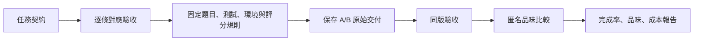

# Benchmark 評測規格

> 封存評測文件：以下保留本版研究條件；現行工具見[SPEC](../../../SPEC.zh-TW.md)，最新保留研究與版本差異見[測試索引](../../README.zh-TW.md)。不要將當時模型、題目或提示改寫為現行預設。

這份評測包把任務、驗收、品味判斷與判分程式放在一起。**先固定規格，再執行 A/B；所有交付使用同一版本。**

封存版本與檔案指紋見 `manifest.json`，使用前由 `evaluate.py verify` 核對。信箱題已依官方修法與原驗收釐清重試時序，決定與來源見[契約釐清紀錄](cases/proton-mailbox-retry/contract-resolution.json)。下一輪 Actor 測試尚未開始。

## 從哪裡看

- [評分與版本規則](PROTOCOL.zh-TW.md)：完成率、品味、成本怎麼算；如何處理更正。
- [逐題契約與驗收](CONTRACTS.zh-TW.md)：12 題、64 組要求，連到完整原文與檢查。
- [品味盲評指示](blind-rubric.txt)：六項準則、匿名比較及輸出格式。
- [驗收審查紀錄](oracle-review.json)：移除的額外限制與保留檢查的依據。

## 固定的判分方式

| 項目 | 判定方式 |
|---|---|
| 固定驗收 | 該題全部登錄檢查通過；缺少結果不算通過 |
| 任務完成 | 固定驗收通過，且同份交付的執行紀錄符合修改範圍等明訂限制 |
| 環境故障 | 留下故障紀錄，不能直接當作程式違約 |
| 品味 | 共同完成任務的配對，依六項結構準則盲評 |
| 只有一方完成 | 單獨列出，保留完成任務的差異 |
| 成本 | Actor 與 Provider 的實際時間及 token，列明分母 |
| 新發現的反例 | 先作診斷；改評測需另立版本，全部比較對象一起重評 |

題目沒有指定的內部資料結構、字串引號或除錯 trait，不能成為失敗理由。原始碼中明訂的介面與限制仍須遵守。共用測試失敗時，報告保留實際失敗斷言；不能把它涵蓋的所有條款都寫成已違反。

## 執行與封存

`evaluate.py audit` 檢查條文引用與檢查對照。`container_checks.py`、`native_checks.py` 接收題目與交付 patch，不接收 A／B 標籤；使用隔離環境，換上固定測試，保存完整輸出。

校準完成後，`evaluate.py seal` 產生 `manifest.json`，固定本包每個檔案的 SHA-256。`verify` 與 `score` 會拒絕修改過的評測包、錯誤的交付指紋或額外插入的判分項目。已存在的結果檔不能覆寫。

`--calibration` 僅用於封存前校準，輸出的識別碼帶有 `calibration:`，不能交給正式 `score` 冒充封存版結果。校準結果不更新任何歷史 A/B 分數。

容器以映像 SHA 固定；原生工具版本記錄在 [environment.json](environment.json)，Rust 依賴由各題的 `Cargo.lock` 固定。原始交付與完整執行日誌保存在評測工作目錄，正式比較需附同一評測指紋及原始交付指紋。
